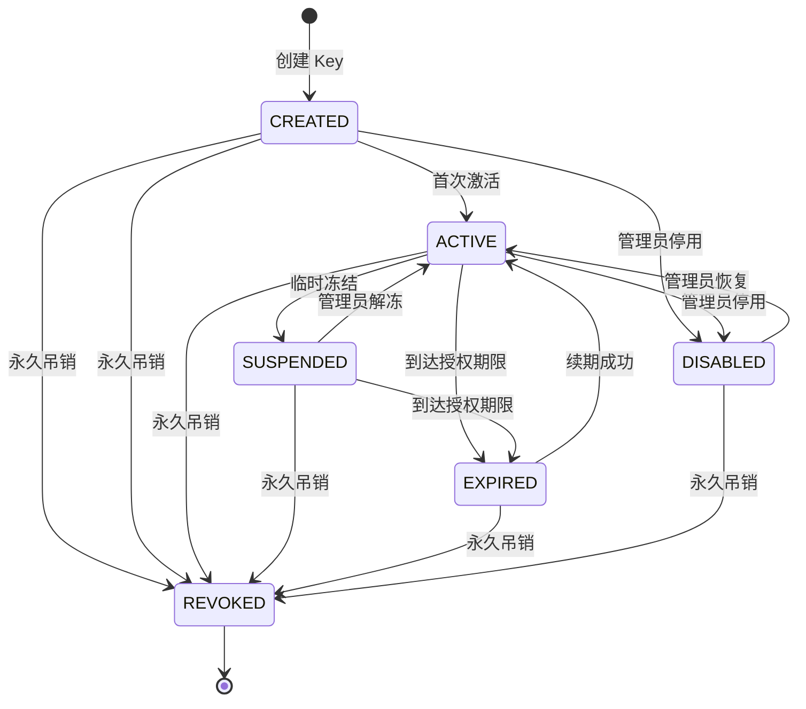
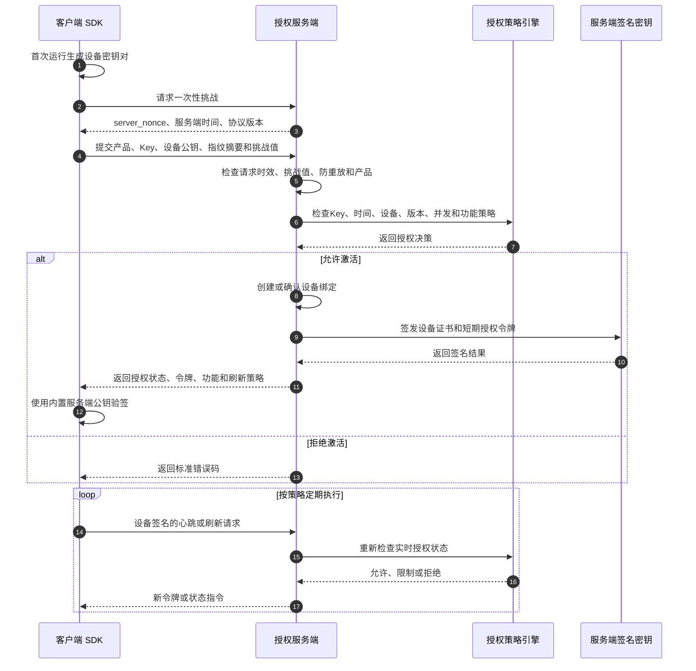

# 通用 Key 授权服务端——第一步：需求与授权协议设计

> 文档版本：V1.0-draft  
> 编制日期：2026-08-24  
> 当前阶段：第一步，仅定义需求、规则与协议；不包含数据库设计、程序实现和部署配置。

---

## 1. 项目目标

建设一套可以同时服务多个软件产品的通用 Key 授权平台。平台负责 Key 的生成与生命周期管理、设备激活、授权验证、授权续期、离线许可、功能权限下发、远程冻结与吊销，并向不同语言和平台的客户端提供统一授权协议。

### 1.1 核心目标

1. 一个服务端管理多个产品和多个版本。
2. 同一套协议支持 Windows、macOS、Linux、Android、iOS、Web 服务、脚本和插件。
3. 支持单设备、多设备、限时、固定到期、永久、试用和功能模块授权。
4. 服务端是授权状态的最终裁决方。
5. 客户端不保存服务端私钥，也不依赖可被提取的全局主密钥。
6. 支持在线验证与有限时间的离线运行。
7. 支持远程冻结、吊销、解绑和强制重新验证。
8. 授权规则由配置驱动，不为某个产品写死。

### 1.2 非目标

以下内容不进入第一版授权核心：

- 支付接口与自动续费
- 代理商分销和余额系统
- 短信、邮件营销
- 软件文件下载和 CDN
- 完整订单财务系统
- 软件本体的反调试、加壳和反破解实现
- 区块链授权

这些能力以后通过独立模块接入，不污染授权核心。

---

## 2. 系统角色

| 角色 | 主要职责 |
|---|---|
| 平台超级管理员 | 管理租户、平台配置、签名密钥、全局安全策略 |
| 产品管理员 | 创建产品、版本、功能项和授权策略 |
| 授权管理员 | 生成、续期、冻结、吊销 Key，管理绑定设备 |
| 审计人员 | 查看操作日志、授权事件和风险记录，不允许修改授权 |
| 最终用户 | 使用 Key 激活软件，查看自己的授权和设备 |
| 客户端 SDK | 采集必要设备信息、发起激活、验证服务端签名令牌 |
| 授权服务端 | 验证策略、绑定设备、签发令牌、维护最终授权状态 |

---

## 3. 产品范围与隔离规则

### 3.1 多产品模型

每个产品拥有独立的：

- 产品编码 `product_code`
- 产品状态
- 支持版本范围
- 授权策略
- 功能权限集合
- 客户端接入配置
- 签名密钥版本
- 离线宽限策略
- 风控策略

不同产品的 Key 不允许交叉使用。

### 3.2 多租户预留

第一版的数据和协议必须携带租户边界，但管理界面可以先只启用单租户模式。任何产品、Key、设备和授权事件都必须归属明确的租户，防止以后扩展代理商或 SaaS 模式时重构授权核心。

### 3.3 环境隔离

至少区分：

- 开发环境
- 测试环境
- 正式环境

不同环境使用不同的产品标识、数据和签名私钥；测试 Key 不得在正式环境使用。

---

## 4. 第一版授权能力

### 4.1 Key 类型

第一版支持以下类型：

| 类型 | 说明 | 起算方式 |
|---|---|---|
| 试用授权 | 供首次体验使用 | 首次激活时起算 |
| 时长授权 | 激活后有效若干天/月 | 首次激活时起算 |
| 固定到期授权 | 到指定日期统一到期 | 创建时确定到期时间 |
| 永久授权 | 不因时间自动到期 | 无业务到期时间，但仍可冻结或吊销 |
| 功能授权 | 只开放指定功能 | 依附于以上时间类型 |

第一版暂不实现按次数扣减、点数消费和复杂计费，但协议为 `usage_limits` 预留扩展字段。

### 4.2 设备规则

每个 Key 可以配置：

- 最大绑定设备数 `max_devices`
- 最大同时在线数 `max_concurrent_sessions`
- 是否允许用户自助解绑
- 自助解绑冷却时间
- 管理员是否允许强制解绑
- 设备更换后的重新激活规则
- 是否强制设备绑定

默认规则：

- 默认最大绑定设备数为 1。
- 默认最大同时在线数为 1。
- 同一设备重复激活不重复占用设备名额。
- 设备解绑后，旧设备立即失去在线续期资格。
- 已签发的离线令牌最迟在其有效期结束后失效，因此远程吊销不是绝对即时。

### 4.3 版本规则

产品可以配置：

- 最低允许版本
- 最新推荐版本
- 强制升级版本
- 禁止使用的版本范围
- 不同授权套餐允许使用的版本范围

客户端提交的版本必须是规范化版本号，不接受任意描述文本参与版本比较。

### 4.4 功能权限

服务端可以向客户端下发功能权限，例如：

```text
basic.use
project.create
export.pdf
export.excel
plugin.access
api.access
advanced.analysis
```

每项权限可以包含：

- 是否允许
- 数量限制
- 周期限制
- 参数限制
- 权限到期时间

客户端界面隐藏功能不等于安全控制。涉及服务端资源的功能，业务服务端仍需再次检查权限。

---

## 5. 授权状态定义

### 5.1 Key 状态

| 状态 | 含义 | 是否允许新激活 | 是否允许续期 |
|---|---|---:|---:|
| `CREATED` | 已创建，尚未激活 | 是 | 否 |
| `ACTIVE` | 正常使用 | 视设备额度 | 是 |
| `SUSPENDED` | 临时冻结 | 否 | 否 |
| `EXPIRED` | 已到期 | 否 | 否 |
| `REVOKED` | 永久吊销 | 否 | 否 |
| `DISABLED` | 管理员停用 | 否 | 否 |

### 5.2 设备绑定状态

| 状态 | 含义 |
|---|---|
| `ACTIVE` | 正常绑定，可以验证和续期 |
| `UNBOUND` | 已解绑，不再允许使用原设备凭证 |
| `BLOCKED` | 设备被封禁 |
| `REPLACED` | 因换机被新绑定替代 |

### 5.3 会话状态

| 状态 | 含义 |
|---|---|
| `VALID` | 正常在线会话 |
| `GRACE` | 服务暂不可用时处于宽限期 |
| `EXPIRED` | 会话令牌已过期 |
| `REVOKED` | 会话已被服务端撤销 |

### 5.4 Key 状态机



规则：`REVOKED` 是不可逆状态。如果误操作，应重新发放新 Key，不能恢复原 Key。

---

## 6. 关键业务规则

### 6.1 首次激活

首次激活必须同时满足：

1. 产品存在且已启用。
2. Key 存在并属于该产品。
3. Key 状态允许激活。
4. Key 未到期。
5. 设备未被封禁。
6. 绑定设备数未超过限制。
7. 客户端版本满足产品规则。
8. 请求未过期且未被重放。
9. 风控规则没有明确拒绝。

首次激活成功后：

- 时长授权从服务端激活时间开始计算。
- 创建设备绑定。
- 记录激活事件。
- 签发设备凭证和短期授权令牌。
- 返回功能权限、有效期、心跳间隔和离线策略。

### 6.2 重复激活

同一 Key、同一设备再次激活：

- 不重复计算设备数量。
- 不重新计算授权起始时间。
- 可以重新签发设备凭证和授权令牌。
- 必须记录重复激活事件。

### 6.3 多设备激活

- 当前活动绑定数小于 `max_devices` 时允许绑定新设备。
- 达到上限时返回设备额度不足。
- 管理员可以解绑指定设备后允许新设备激活。
- 是否允许最终用户自助解绑由授权策略决定。

### 6.4 到期

- 所有时间判断以服务端 UTC 时间为准。
- 客户端本地时间只能用于展示，不能决定授权是否有效。
- 已到期 Key 不再获得新令牌。
- 客户端缓存令牌到期后必须停止受保护功能。
- 续期成功后可以从 `EXPIRED` 恢复为 `ACTIVE`。

### 6.5 冻结与吊销

- 冻结用于临时停止，可以恢复。
- 吊销用于泄露、欺诈或永久作废，不可恢复。
- 在线客户端在下次心跳或令牌刷新时收到状态变化。
- 离线客户端最迟在离线令牌到期时停止授权。

### 6.6 服务端临时不可用

- 已持有有效本地签名令牌的客户端可继续运行到令牌到期。
- 如果策略允许，可进入离线宽限期。
- 从未成功激活的客户端不能因为服务端不可用而绕过激活。
- 客户端不能自行延长令牌期限。

---

## 7. 安全信任模型

### 7.1 基本原则

1. 所有公网通信使用 HTTPS。
2. 服务端持有授权签名私钥，客户端只持有公钥。
3. 客户端不得内置能够签发全局授权的共享主密钥。
4. 每台设备首次激活时生成独立设备密钥对。
5. 设备私钥优先保存在操作系统安全存储中。
6. 后续敏感请求由设备私钥签名，服务端使用已登记公钥验证。
7. 服务端返回的授权令牌必须进行非对称签名。
8. 请求使用时间戳、随机数和服务端挑战值防止重放。
9. 日志不得记录完整明文 Key、设备私钥或服务端私钥。

### 7.2 密钥角色

| 密钥 | 保存位置 | 用途 |
|---|---|---|
| 服务端授权私钥 | 仅服务端 KMS/HSM 或受保护密钥服务 | 签发授权令牌和设备证书 |
| 服务端授权公钥 | 客户端 SDK，可按版本内置多个 | 验证服务端返回的授权内容 |
| 设备私钥 | 客户端本地安全存储 | 证明请求来自已绑定设备 |
| 设备公钥 | 服务端 | 验证设备签名 |
| Key | 用户持有；服务端安全索引 | 首次激活或重新绑定时证明授权资格 |

### 7.3 推荐签名策略

- 授权令牌使用非对称数字签名。
- 协议必须包含 `key_id`，支持服务端签名密钥轮换。
- 客户端同时保留当前和上一版本公钥，保证平滑轮换。
- 不允许客户端通过关闭验签继续运行。
- 令牌负载与签名分开验证，任何负载修改都必须导致验签失败。

---

## 8. 通信协议约定

### 8.1 基础约定

| 项目 | 约定 |
|---|---|
| 传输协议 | HTTPS |
| 数据格式 | JSON |
| 字符编码 | UTF-8 |
| API 版本 | URL 中使用 `/api/v1` |
| 服务端时间 | UTC，ISO 8601 格式 |
| 请求 ID | 每次请求使用唯一 `request_id` |
| 客户端随机数 | 每次请求生成唯一 `client_nonce` |
| 服务端挑战值 | 激活前通过挑战接口获得，一次性使用 |
| 幂等键 | 激活、解绑等写操作必须支持 `idempotency_key` |
| 内容摘要 | 对规范化请求体计算摘要后参与设备签名 |

### 8.2 通用请求头

```text
X-Request-Id       请求唯一编号
X-Product-Code     产品编码
X-Client-Version   客户端版本
X-Timestamp        UTC 时间戳
X-Client-Nonce     客户端随机数
X-Device-Id        已激活后携带的设备标识
X-Key-Id           使用的设备签名密钥版本
X-Signature        设备对规范化请求的签名
Idempotency-Key    写操作幂等键
```

首次挑战请求没有设备身份，可以不携带设备签名。首次激活通过一次性服务端挑战值、Key、设备公钥、HTTPS 和风控共同保护。

### 8.3 通用响应结构

```json
{
  "request_id": "请求唯一编号",
  "success": true,
  "code": "OK",
  "message": "操作成功",
  "server_time": "2026-08-24T00:00:00Z",
  "data": {}
}
```

失败响应仍保持相同外层结构：

```json
{
  "request_id": "请求唯一编号",
  "success": false,
  "code": "LICENSE_DEVICE_LIMIT_REACHED",
  "message": "授权设备数量已达到上限",
  "server_time": "2026-08-24T00:00:00Z",
  "data": {
    "retryable": false
  }
}
```

生产环境错误信息不得暴露数据库结构、内部异常堆栈、私钥信息或风控细节。

---

## 9. 第一版客户端授权接口

本节只定义职责和协议边界，不进入代码实现。

### 9.1 获取一次性挑战

```text
POST /api/v1/challenges
```

用途：

- 获取一次性 `server_nonce`
- 返回服务端时间
- 返回协议版本
- 降低激活请求被直接重放的风险

挑战值必须短时间有效且只能成功使用一次。

### 9.2 激活授权

```text
POST /api/v1/licenses/activate
```

请求核心字段：

```text
product_code
license_key
device_public_key
device_fingerprint_hash
device_name
platform
os_version
client_version
server_nonce
client_nonce
timestamp
idempotency_key
```

响应核心字段：

```text
license_id
device_id
activation_id
license_status
issued_at
expires_at
offline_until
heartbeat_interval_seconds
refresh_after_seconds
features
device_certificate
license_token
signing_key_id
```

### 9.3 验证授权

```text
POST /api/v1/licenses/verify
```

用途：

- 查询授权是否仍有效
- 检查设备、产品、版本和功能策略
- 返回最新服务端状态

请求必须由已登记设备私钥签名。

### 9.4 刷新授权令牌

```text
POST /api/v1/licenses/refresh
```

用途：

- 在短期令牌即将到期时获取新令牌
- 同步最新功能权限和授权有效期
- 让冻结、吊销和版本策略及时生效

刷新成功不改变 Key 原始到期时间。

### 9.5 心跳

```text
POST /api/v1/sessions/heartbeat
```

用途：

- 更新设备最后在线时间
- 维持在线会话
- 执行并发数量控制
- 下发需要重新验证、升级或退出的指令

客户端心跳需要加入随机抖动，避免大量客户端在相同秒数集中请求。

### 9.6 释放在线会话

```text
POST /api/v1/sessions/release
```

用途：客户端正常退出时主动释放在线会话。异常退出时由服务端会话超时机制自动清理。

### 9.7 解绑当前设备

```text
POST /api/v1/devices/unbind
```

用途：在策略允许时解绑当前设备。该操作必须要求设备签名，并可以要求再次输入 Key 或进行用户身份验证。

### 9.8 获取版本策略

```text
POST /api/v1/products/version-policy
```

用途：返回最低版本、推荐版本、强制升级信息和维护公告。服务端不能只依赖客户端主动调用此接口，授权验证时仍要检查版本策略。

---

## 10. 授权令牌定义

授权令牌至少包含：

```text
issuer                 签发方
subject                授权ID
audience               产品编码
tenant_id               租户ID
license_id              授权ID
device_id               绑定设备ID
activation_id           激活记录ID
session_id              在线会话ID
license_type            授权类型
license_status          签发时授权状态
features                功能权限快照
usage_limits            用量限制预留
issued_at               签发时间
not_before              生效时间
expires_at              令牌到期时间
offline_until           最晚离线运行时间
jti                     令牌唯一编号
signing_key_id          服务端签名密钥版本
protocol_version        协议版本
```

### 10.1 两种有效期必须分离

- `license_expires_at`：Key 的业务到期时间。
- `token_expires_at`：本次签名令牌的短期到期时间。

永久 Key 只是没有业务到期时间，不代表令牌永久有效。永久 Key 仍然使用短期令牌，以便冻结、吊销和策略更新能够生效。

### 10.2 客户端本地验证顺序

1. 检查令牌结构。
2. 根据 `signing_key_id` 选择服务端公钥。
3. 验证数字签名。
4. 检查产品编码是否匹配当前软件。
5. 检查设备 ID 是否匹配当前设备凭证。
6. 检查 `not_before` 与 `expires_at`。
7. 检查授权状态。
8. 读取功能权限。
9. 接近刷新时间时请求服务端刷新。

任何关键步骤失败都不能自动变成“授权成功”。

---

## 11. 标准授权流程



---

## 12. 错误码规范

### 12.1 通用错误

| 错误码 | 含义 | 是否建议重试 |
|---|---|---:|
| `INVALID_REQUEST` | 请求格式错误 | 否 |
| `UNSUPPORTED_PROTOCOL_VERSION` | 协议版本不支持 | 否 |
| `REQUEST_EXPIRED` | 请求时间超出允许范围 | 获取服务端时间后重试 |
| `REPLAY_DETECTED` | 检测到重复请求 | 否 |
| `SIGNATURE_INVALID` | 设备请求签名无效 | 否 |
| `RATE_LIMITED` | 请求过于频繁 | 是 |
| `SERVICE_TEMPORARILY_UNAVAILABLE` | 服务临时不可用 | 是 |

### 12.2 产品错误

| 错误码 | 含义 |
|---|---|
| `PRODUCT_NOT_FOUND` | 产品不存在或不可访问 |
| `PRODUCT_DISABLED` | 产品已停用 |
| `CLIENT_VERSION_TOO_OLD` | 客户端版本过低 |
| `CLIENT_VERSION_BLOCKED` | 当前版本被禁止使用 |
| `FORCE_UPDATE_REQUIRED` | 必须升级后才能继续使用 |

### 12.3 授权错误

| 错误码 | 含义 |
|---|---|
| `LICENSE_INVALID` | Key 无效或与产品不匹配 |
| `LICENSE_NOT_ACTIVE` | 授权尚未进入可用状态 |
| `LICENSE_EXPIRED` | 授权已到期 |
| `LICENSE_SUSPENDED` | 授权已冻结 |
| `LICENSE_REVOKED` | 授权已永久吊销 |
| `LICENSE_DISABLED` | 授权已停用 |
| `LICENSE_DEVICE_LIMIT_REACHED` | 绑定设备达到上限 |
| `LICENSE_CONCURRENCY_LIMIT_REACHED` | 同时在线数量达到上限 |
| `FEATURE_NOT_GRANTED` | 未获得指定功能权限 |

### 12.4 设备错误

| 错误码 | 含义 |
|---|---|
| `DEVICE_NOT_REGISTERED` | 设备尚未登记 |
| `DEVICE_CREDENTIAL_INVALID` | 设备凭证无效 |
| `DEVICE_BLOCKED` | 设备已被封禁 |
| `DEVICE_UNBOUND` | 设备已解绑 |
| `DEVICE_FINGERPRINT_MISMATCH` | 设备特征变化超过允许范围 |
| `UNBIND_NOT_ALLOWED` | 当前策略不允许自助解绑 |
| `UNBIND_COOLDOWN_ACTIVE` | 尚未达到允许解绑时间 |

---

## 13. 日志与审计需求

必须记录以下事件：

- Key 创建、导出、续期、冻结、解冻、吊销
- 首次激活和重复激活
- 激活拒绝及机器可读原因
- 设备绑定、解绑、封禁和换机
- 令牌签发与刷新
- 心跳异常和并发超限
- 客户端版本被拒绝
- 管理员登录和敏感操作
- 签名密钥创建、启用、轮换和停用
- 权限策略变更

日志要求：

- 完整 Key 只允许在必要的首次安全交付环节显示。
- 常规日志最多显示脱敏 Key，例如前 4 位和后 4 位。
- 不记录设备私钥、服务端私钥和完整访问令牌。
- 审计事件必须包含操作人、对象、时间、来源 IP、请求 ID 和结果。
- 审计日志不能由普通产品管理员删除或修改。

---

## 14. 第一版默认参数

这些参数必须可配置，以下仅作为初始默认值：

| 参数 | 默认值 |
|---|---:|
| 授权令牌有效期 | 30 分钟 |
| 建议刷新时间 | 令牌签发后 20 分钟 |
| 心跳间隔 | 5 分钟 |
| 心跳超时 | 15 分钟 |
| 请求时间偏差 | 前后 5 分钟 |
| 一次性挑战有效期 | 2 分钟 |
| 离线宽限期 | 24 小时 |
| 默认最大设备数 | 1 |
| 默认最大并发数 | 1 |
| 自助解绑冷却期 | 7 天 |
| Key 连续错误尝试限制 | 按 IP、产品、Key 摘要联合限流 |

高价值或高风险产品可以将离线宽限期配置为 0；低风险桌面软件可以配置更长的离线时间。

---

## 15. 风险与边界说明

1. 客户端运行在用户控制的设备上，不能保证绝对不可破解。
2. 授权系统的目标是增加伪造、复制、滥用和批量攻击成本，并提供可管理的授权状态。
3. 离线时间越长，远程吊销生效越慢。
4. 设备指纹会受到硬件升级、虚拟机和系统重装影响，不能作为唯一身份凭证。
5. 客户端内置的任何共享秘密最终都有被提取的可能，因此不把共享秘密作为系统根信任。
6. 只在客户端限制功能无法保护纯本地算法；重要能力应尽可能由业务服务端二次授权。
7. 服务端必须避免通过错误信息暴露 Key 是否存在，以降低批量枚举风险；后台审计可以保存真实拒绝原因。

---

## 16. 第一阶段验收标准

第一步设计在满足以下条件后视为完成：

- [x] 明确项目目标和第一版非目标。
- [x] 明确系统角色和多产品边界。
- [x] 明确第一版支持的 Key 类型。
- [x] 明确设备、并发、版本和功能权限规则。
- [x] 明确 Key、设备和会话状态。
- [x] 明确激活、重复激活、到期、冻结和吊销行为。
- [x] 明确服务端与客户端的信任边界。
- [x] 明确第一版客户端授权接口清单。
- [x] 明确通用请求和响应结构。
- [x] 明确授权令牌字段和验证顺序。
- [x] 明确错误码命名规则。
- [x] 明确日志和审计要求。
- [ ] 由项目负责人确认第 17 节的业务决策。

第 17 节未确认前，不进入第二步数据库和基础架构设计。

---

## 17. 需要项目负责人确认的业务决策

请按编号确认或修改。未修改时，将采用“建议默认值”。

| 编号 | 决策项 | 建议默认值 |
|---|---|---|
| D01 | 第一版是否启用多产品 | 启用 |
| D02 | 第一版管理端是否先按单租户使用 | 是，但底层预留租户边界 |
| D03 | 默认最大绑定设备数 | 1 台 |
| D04 | 默认最大同时在线数 | 1 个会话 |
| D05 | 是否允许管理员强制解绑 | 允许，并记录审计日志 |
| D06 | 是否允许用户自助解绑 | 默认关闭，可按产品开启 |
| D07 | 自助解绑冷却期 | 7 天 |
| D08 | 默认离线宽限期 | 24 小时，可按产品修改 |
| D09 | 永久 Key 是否仍需定期联网 | 是，定期刷新短期令牌 |
| D10 | Key 吊销后是否允许恢复 | 不允许，重新发放新 Key |
| D11 | 是否支持功能模块授权 | 支持 |
| D12 | 是否在第一版支持按次数/点数扣减 | 不支持，只预留协议字段 |
| D13 | 是否支持版本强制升级 | 支持 |
| D14 | 是否允许同一设备重复激活 | 允许，不重复占设备名额 |
| D15 | 是否要求每台设备生成独立密钥对 | 要求 |
| D16 | 是否允许纯离线首次激活 | 第一版不允许 |
| D17 | 管理后台是否和客户端 API 分离 | 必须分离 |
| D18 | 第一版是否加入支付和代理系统 | 不加入 |

---

## 18. 下一步边界

本文件确认后，第二步才开始设计：

- 系统模块边界
- 数据库实体和关系
- Redis 使用范围
- 服务目录结构
- 管理端与授权端的部署边界
- 密钥服务边界
- 日志与监控基础设施

本阶段不创建代码，不创建数据库迁移，不创建接口实现。
