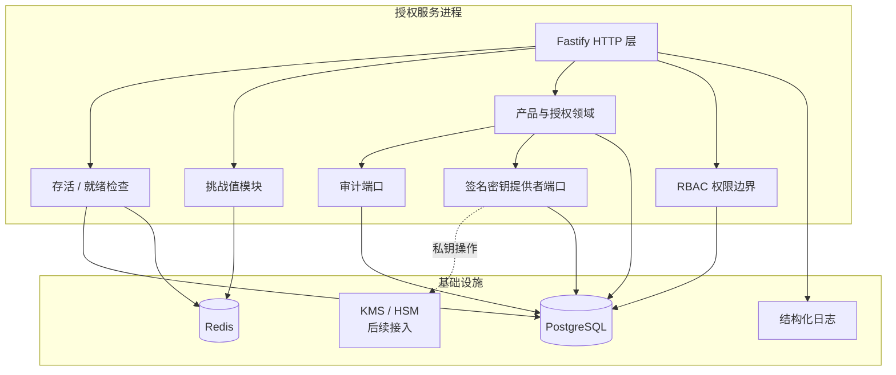
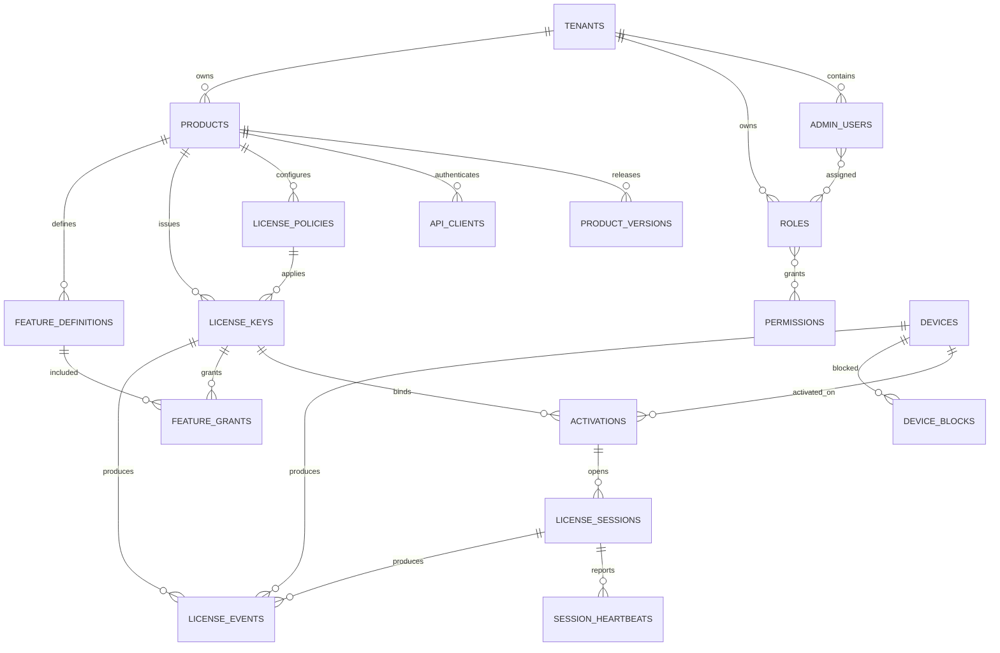

# 通用 Key 授权服务端——第二步：基础架构与数据库设计

> 文档版本：V1.0  
> 编制日期：2026-08-24  
> 本阶段范围：基础设施、数据结构、权限边界、密钥边界、审计与运行监控。  
> 明确不包含：产品管理业务接口、Key 生成业务、设备激活、授权令牌签发和管理后台页面。

---

## 1. 第二步目标

第二步为后续授权业务建立稳定的数据与运行基础：

1. 使用 PostgreSQL 保存最终业务状态和审计记录。
2. 使用 Redis 保存短生命周期、需要原子消费或高频访问的数据。
3. 建立可追踪、可校验、按顺序执行的数据库迁移机制。
4. 建立平台与租户两级 RBAC 权限模型。
5. 将管理端和客户端授权端在逻辑边界上隔离。
6. 将签名私钥与业务数据库隔离，只在数据库保存密钥元数据和提供者引用。
7. 提供存活检查和基础设施就绪检查。
8. 保持模块化单体结构，为后续独立部署授权验证节点预留边界。

---

## 2. 运行架构



### 当前部署方式

当前采用模块化单体：

- 一个 Node.js 服务进程。
- 一个 PostgreSQL 实例。
- 一个 Redis 实例。
- 管理端 API 与客户端 API 使用不同路由前缀和权限链，当前仍可运行在同一进程。

### 后续可拆分边界

后续扩容时可以拆为：

- 管理服务：产品、Key、角色权限、配置和审计。
- 授权服务：挑战、激活、验证、刷新、心跳。
- 签名服务：访问 KMS/HSM 并签发授权令牌。

本阶段只建立边界，不实现拆分和远程调用。

---

## 3. 模块目录

```text
src/
├─ config/                         环境配置
├─ infrastructure/
│  ├─ cache/                       Redis 与缓存抽象
│  ├─ database/                    PostgreSQL 连接和事务
│  └─ runtime/                     基础设施生命周期组合
├─ modules/
│  ├─ audit/                       审计写入端口
│  ├─ challenges/                  一次性挑战值
│  ├─ cryptography/                签名密钥提供者端口
│  ├─ health/                      存活与就绪检查
│  ├─ identity/                    RBAC 权限定义
│  ├─ licenses/                    授权领域
│  └─ products/                    产品领域
└─ shared/
   ├─ errors/                      统一业务异常
   ├─ health/                      健康报告类型
   └─ http/                        API 响应和错误处理

database/
└─ migrations/                     只增不改的 SQL 迁移

scripts/
├─ migrate.ts                      执行未应用迁移
└─ migration-status.ts             查询迁移状态
```

模块规则：

- 领域模块不能直接创建 PostgreSQL 或 Redis 客户端。
- 外部基础设施通过接口注入领域模块。
- HTTP 路由只负责协议解析和响应，不直接编写 SQL。
- 签名业务只依赖 `SigningKeyProvider`，不依赖某个云厂商 SDK。
- 审计业务只依赖 `AuditLogPort`。

---

## 4. PostgreSQL 职责

PostgreSQL 是以下信息的最终事实来源：

- 租户与管理员
- 角色与权限
- 产品和版本
- API 客户端身份
- 授权策略
- Key 状态和有效期
- 设备与绑定关系
- 功能权限
- 在线会话的持久状态
- 设备封禁
- 授权事件
- 签名密钥元数据
- 系统配置
- 审计日志

授权状态不能只保存在 Redis 中。

---

## 5. 数据表关系



### 核心表

| 表 | 用途 |
|---|---|
| `tenants` | 租户边界 |
| `admin_users` | 平台和租户管理员 |
| `roles` | 平台级或租户级角色 |
| `permissions` | 权限字典 |
| `admin_user_roles` | 管理员角色关系 |
| `role_permissions` | 角色权限关系 |
| `products` | 授权产品 |
| `product_versions` | 产品版本策略 |
| `api_clients` | 管理端、产品端和服务端客户端身份 |
| `license_policies` | 可复用授权策略 |
| `license_keys` | Key 的最终授权状态 |
| `devices` | 设备公钥和设备特征摘要 |
| `activations` | Key 与设备绑定关系 |
| `feature_definitions` | 产品功能字典 |
| `feature_grants` | Key 获得的功能权限 |
| `license_sessions` | 授权会话持久状态 |
| `session_heartbeats` | 心跳审计记录 |
| `device_blocks` | 设备或指纹封禁记录 |
| `license_events` | 激活、验证和吊销等授权事件 |
| `signing_keys` | 签名密钥公开信息和提供者引用 |
| `system_settings` | 平台、租户和产品配置 |
| `audit_logs` | 管理员和系统敏感操作审计 |

---

## 6. Key 数据安全

`license_keys` 不保存完整明文 Key，只保存：

- `key_hash`：用于安全查询和比较。
- `key_prefix`：用于后台脱敏展示。
- `key_suffix`：用于后台脱敏展示。

完整 Key 只允许在后续生成时一次性安全交付，不进入普通日志和查询响应。

数据库当前只定义字段约束，不在第二步实现 Key 生成、哈希和交付业务。

---

## 7. Redis 使用范围

### 已实现

| Key 格式 | 数据 | TTL | 原子要求 |
|---|---|---:|---|
| `{prefix}challenge:{serverNonce}` | 一次性挑战内容 | 默认 120 秒 | 使用 `GETDEL` 单次消费 |

当前 Redis 挑战值代替第一阶段的内存存储，因此服务可以部署多个节点并共享挑战状态。

### 后续保留范围

以下 Redis 用途已经划定，但第二步不实现对应业务：

```text
{prefix}request-nonce:{deviceId}:{nonce}     请求防重放
{prefix}idempotency:{scope}:{key}            写操作幂等结果
{prefix}session:{sessionId}                  短期会话缓存
{prefix}online:{licenseId}                   并发在线集合
{prefix}revoked-token:{jti}                  令牌吊销标记
{prefix}rate-limit:{dimension}:{value}       限流计数
```

规则：

- Redis 丢失不能改变 Key 的最终有效期和吊销状态。
- Redis 中的安全数据必须有明确 TTL。
- 多步骤原子操作使用 Lua 或事务，不能依赖进程锁。
- Redis Key 必须统一添加环境/服务前缀。

---

## 8. RBAC 权限模型

权限采用固定机器码，角色由权限组合而成。

### 平台权限

- `platform.tenants.manage`
- `signing-keys.manage`
- `settings.manage`

### 租户管理权限

- `admin.users.manage`
- `admin.roles.manage`
- `products.read`
- `products.write`
- `licenses.read`
- `licenses.write`
- `licenses.export`
- `devices.read`
- `devices.unbind`
- `devices.block`
- `audit.read`

原则：

1. 平台角色的 `tenant_id` 必须为空。
2. 租户角色必须归属一个租户。
3. 权限检查必须同时验证租户边界。
4. 只有授权管理权限不能读取或轮换签名私钥。
5. 审计人员可以读取审计日志，但不能修改授权状态。
6. 敏感操作需要在后续管理接口中写入审计日志。

第二步只建立权限字典、关系表和权限判断函数，不实现管理员登录。

---

## 9. 签名密钥边界

数据库表 `signing_keys` 只保存：

- Key ID
- 算法
- KMS/HSM 提供者
- 提供者内部引用
- 公钥
- 密钥状态
- 启用和退役时间

数据库禁止保存签名私钥明文。

代码通过 `SigningKeyProvider` 访问签名能力：

```text
sign(payload)
getVerificationKeys()
```

当前只定义接口，不生成密钥、不签发令牌，也不接入具体 KMS/HSM。这些属于后续授权令牌阶段。

---

## 10. 审计边界

所有敏感操作通过 `AuditLogPort` 写入统一审计事件，事件包含：

- 操作主体类型和 ID
- 租户 ID
- 操作名称
- 资源类型和 ID
- 请求 ID
- 来源 IP
- User-Agent
- 成功或失败
- 修改前后数据
- 扩展元数据
- 服务端发生时间

审计表不设置普通业务级联删除，避免产品或 Key 删除时审计证据一起消失。

---

## 11. 健康检查

### 存活检查

```text
GET /health
```

只判断服务进程是否能够处理 HTTP 请求，不查询数据库和 Redis。

### 就绪检查

```text
GET /ready
```

检查：

- PostgreSQL `SELECT 1`
- Redis `PING`

任一基础设施不可用时返回 HTTP 503 和标准错误码：

```text
SERVICE_TEMPORARILY_UNAVAILABLE
```

部署平台应使用 `/health` 判断是否重启进程，使用 `/ready` 判断是否把流量转发给节点。

---

## 12. 数据库迁移规则

迁移目录：

```text
database/migrations/
```

命名规则：

```text
0001_initial_schema.sql
0002_xxx.sql
0003_xxx.sql
```

迁移机制具备：

- 按文件名排序执行。
- `schema_migrations` 记录已应用迁移。
- SHA-256 校验已应用文件是否被修改。
- PostgreSQL advisory lock 防止多节点同时执行迁移。
- 每个迁移在独立事务中执行。
- 失败后回滚当前迁移。

规则：已经应用到任何共享环境的迁移文件不得修改，只能新增下一编号迁移。

---

## 13. 本地基础设施

`compose.yaml` 定义：

- PostgreSQL 16
- Redis 7
- 持久化数据卷
- 服务健康检查

启动顺序：

```powershell
pnpm infra:up
pnpm db:migrate
pnpm dev
```

查询迁移状态：

```powershell
pnpm db:status
```

停止本地基础设施：

```powershell
pnpm infra:down
```

正式环境不得使用示例密码，必须由秘密管理系统注入连接信息。

---

## 14. 第二步验收结果

- [x] PostgreSQL 连接池和事务封装。
- [x] Redis 客户端和原子获取删除能力。
- [x] 挑战值切换为 Redis 持久化 TTL 存储。
- [x] `/health` 存活检查。
- [x] `/ready` PostgreSQL 与 Redis 就绪检查。
- [x] 首版数据库迁移。
- [x] 多租户数据结构。
- [x] RBAC 权限字典和关系表。
- [x] Key 只保存哈希与展示片段。
- [x] 签名密钥只保存元数据和提供者引用。
- [x] 审计日志表和代码端口。
- [x] Docker Compose 本地基础设施定义。
- [x] 迁移执行和状态查询脚本。
- [x] 自动化测试覆盖第二步结构约束。

---

## 15. 阶段边界

第二步结束后仍然没有实现：

- 创建产品的管理接口
- 创建授权策略的管理接口
- 生成和导出 Key
- 激活 Key
- 绑定设备
- 验证设备签名
- 签发授权令牌
- 心跳与并发控制
- 管理后台页面

这些功能必须在收到下一阶段命令后再开发。
