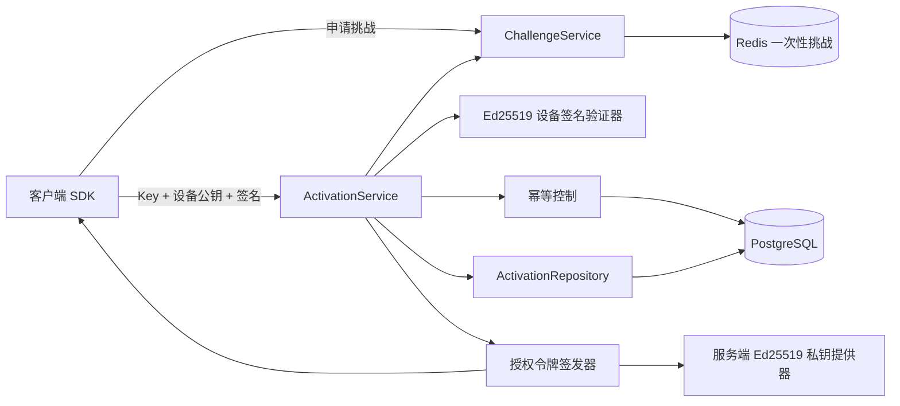

# 通用 Key 授权服务端——第四步：激活、设备绑定与授权令牌

## 1. 用一句话理解第四步

第三步负责“生产和管理 Key”，第四步负责让客户端拿着 Key 完成第一次安全激活，并获得可以本地验签的短期授权令牌。

本步骤只打通下面这一条链路：

```text
客户端生成 Ed25519 设备密钥对
    ↓
请求一次性挑战 server_nonce
    ↓
用设备私钥签名激活请求
    ↓
服务端一次性消费挑战，检查 Key、产品、版本和设备额度
    ↓
登记设备并创建绑定
    ↓
Key 首次从 CREATED 变成 ACTIVE
    ↓
签发设备凭证和短期授权令牌
```

## 2. 第四步最简单使用顺序

1. 服务端管理员先按第三步创建产品、策略和 Key。
2. 客户端第一次运行时，在本机生成一对 Ed25519 密钥。
3. 客户端只把公钥发送给服务端，私钥永远不上传。
4. 客户端调用 `POST /api/v1/challenges` 获取一次性挑战。
5. 客户端把激活请求整理成固定格式，用设备私钥签名。
6. 客户端调用 `POST /api/v1/licenses/activate`。
7. 服务端检查通过后返回 `device_certificate` 和 `license_token`。
8. 客户端用内置的服务端公钥验证两个签名结果。

## 3. 第四步模块图



## 4. 本步骤公开接口

### 4.1 获取一次性挑战

```text
POST /api/v1/challenges
```

请求：

```json
{
  "product_code": "designer-pro",
  "client_nonce": "6QjV7FGwE5P0D4A7mXu3zA"
}
```

返回的 `server_nonce` 只能消费一次，默认 120 秒后过期。

### 4.2 激活授权

```text
POST /api/v1/licenses/activate
```

必要请求头：

```http
X-Request-Id: 客户端请求编号
X-Product-Code: designer-pro
X-Client-Version: 1.2.0
X-Timestamp: 2026-08-24T12:00:00.000Z
X-Client-Nonce: 6QjV7FGwE5P0D4A7mXu3zA
X-Key-Id: device-key-v1
X-Signature: 设备私钥生成的Base64URL签名
Idempotency-Key: 550e8400-e29b-41d4-a716-446655440000
```

请求体：

```json
{
  "product_code": "designer-pro",
  "license_key": "ULK1-ABCD-EFGH-JKMP-QRST-WXYZ",
  "device_public_key": "-----BEGIN PUBLIC KEY-----\n...\n-----END PUBLIC KEY-----",
  "device_fingerprint_hash": "64位SHA-256十六进制摘要",
  "device_name": "办公室电脑",
  "platform": "windows",
  "os_version": "Windows 11 24H2",
  "client_version": "1.2.0",
  "server_nonce": "挑战接口返回的值",
  "client_nonce": "6QjV7FGwE5P0D4A7mXu3zA",
  "timestamp": "2026-08-24T12:00:00.000Z",
  "idempotency_key": "550e8400-e29b-41d4-a716-446655440000"
}
```

请求头中的产品、版本、时间、随机数和幂等键必须与请求体完全一致，避免中间层改写关键参数。

## 5. 设备签名怎么计算

### 5.1 固定规范化内容

客户端先对请求体做“键名排序的 JSON”，再计算 SHA-256。随后拼接：

```text
v1
POST
/api/v1/licenses/activate
产品编码
客户端版本
时间戳
客户端随机数
服务端挑战值
幂等键
设备密钥编号（X-Key-Id）
请求体SHA-256十六进制
```

注意：每一项之间只有一个换行符，最后没有额外换行。

### 5.2 签名算法

```text
算法：Ed25519
输入：上面的 UTF-8 字节
输出：Base64URL，不带等号
```

服务端会使用本次请求提交的设备公钥验证签名。这一步证明客户端确实持有对应私钥，不能只复制别人的公钥完成激活。

## 6. 激活检查顺序

服务端严格按下面顺序处理：

1. 检查服务端签名私钥是否配置。
2. 检查请求时间是否在允许误差内，默认前后 300 秒。
3. 申请幂等执行权，防止重复提交创建多条数据。
4. 一次性消费 `server_nonce`。
5. 检查挑战中的产品和 `client_nonce` 是否与激活请求一致。
6. 验证设备公钥确实是 Ed25519 公钥。
7. 验证 `X-Signature`。
8. 对 Key 做 HMAC-SHA-256，数据库不查明文。
9. 检查产品是否启用。
10. 检查客户端版本是否被封禁、过低或必须升级。
11. 检查 Key 状态和业务到期时间。
12. 检查设备或设备指纹是否被封禁。
13. 检查设备绑定额度。
14. 创建或确认设备绑定。
15. 创建短期授权会话。
16. 签发设备凭证和授权令牌。
17. 保存幂等响应。

## 7. 首次激活与重复激活

### 7.1 首次激活

- `CREATED` Key 变为 `ACTIVE`。
- `TRIAL` 和 `DURATION` 从服务端当前时间开始计算有效期。
- `FIXED_EXPIRY` 保持创建 Key 时设置的固定到期时间。
- `PERPETUAL` 没有业务到期时间，但签发的令牌仍然是短期令牌。
- 创建设备、激活绑定、会话和授权事件。

### 7.2 同一设备重复激活

- 不重复占用设备名额。
- 不重新计算 Key 的业务开始时间和到期时间。
- 原设备的旧在线会话会被撤销。
- 为该设备签发新的设备凭证和短期令牌。
- 授权事件记为 `LICENSE_REACTIVATED`。

### 7.3 不同设备激活

- 活动绑定数小于 `max_devices` 才允许。
- 达到上限返回 `LICENSE_DEVICE_LIMIT_REACHED`。
- 本步骤不实现解绑，解绑属于后续步骤。

## 8. 版本规则

激活时不能只相信客户端自己调用版本查询接口，服务端会直接检查：

- 产品 `DISABLED`：返回 `PRODUCT_DISABLED`。
- 当前版本在版本表中为 `BLOCKED`：返回 `CLIENT_VERSION_BLOCKED`。
- 当前版本记录要求强制升级，或者低于产品的强制升级版本：返回 `FORCE_UPDATE_REQUIRED`。
- 当前版本低于最低支持版本：返回 `CLIENT_VERSION_TOO_OLD`。

版本比较支持常见的点号数字，例如 `1.2.10` 会正确大于 `1.2.9`。

## 9. 授权令牌

服务端返回的是 Ed25519 签名的紧凑令牌：

```text
Base64URL(头).Base64URL(负载).Base64URL(签名)
```

授权令牌至少包含：

```text
iss                     签发方
sub                     授权ID
aud                     产品编码
tenant_id               租户ID
license_id              授权ID
device_id               设备ID
activation_id           激活绑定ID
session_id              会话ID
license_type            授权类型
license_status          签发时状态
license_expires_at       Key业务到期时间
features                 功能权限快照
usage_limits             设备数和并发数快照
iat / nbf / exp          令牌签发、生效和到期时间
offline_until            最晚离线时间
jti                      令牌唯一编号
signing_key_id           服务端签名密钥编号
protocol_version         协议版本
```

永久 Key 也只获得短期令牌，不能把永久授权理解成“永久令牌”。

## 10. 设备凭证

`device_certificate` 同样由服务端 Ed25519 私钥签名，绑定：

- 租户
- 产品
- 授权
- 设备
- 激活记录
- 设备公钥指纹
- 设备密钥版本
- 签发时间和到期时间

设备私钥仍然只保存在客户端，不会进入数据库、日志或设备凭证。

## 11. 幂等与防重放

### 一次性挑战

Redis 使用原子 `GETDEL`，同一个挑战第二次使用会返回 `REPLAY_DETECTED`。

### 幂等键

PostgreSQL 保存激活幂等记录：

- 第一次请求取得执行权。
- 完全相同的请求重试，直接返回第一次成功结果。
- 同一个幂等键换了请求内容，返回 `IDEMPOTENCY_CONFLICT`。
- 同一个请求正在处理中，返回 `REQUEST_IN_PROGRESS`。
- 处理中进程异常退出后，记录过期即可重新取得执行权。

幂等响应不保存明文 Key，只保存签发结果和必要标识。

## 12. 数据库变化

第四步迁移文件：

```text
database/migrations/0003_activation_stage.sql
```

新增 `activation_idempotency_records`，用于：

- 防止重复激活造成重复设备和会话。
- 缓存成功激活响应。
- 检查同一个幂等键是否被换内容使用。

现有表继续负责：

- `devices`：设备登记。
- `activations`：Key 和设备绑定。
- `license_sessions`：短期授权会话。
- `license_events`：激活和重复激活事件。
- `device_blocks`：设备及指纹封禁检查。

## 13. 环境变量

```env
# Key 查询摘要密钥，第三步已有
LICENSE_KEY_PEPPER=至少32个字符

# 第四步服务端 Ed25519 私钥，内容是 PKCS#8 PEM 再做 Base64
LICENSE_SIGNING_PRIVATE_KEY_PEM_BASE64=替换为真实私钥Base64
LICENSE_SIGNING_KEY_ID=license-signing-v1
LICENSE_TOKEN_ISSUER=universal-license-server

LICENSE_TOKEN_TTL_SECONDS=900
DEVICE_CERTIFICATE_TTL_SECONDS=2592000
ACTIVATION_REQUEST_MAX_SKEW_SECONDS=300
ACTIVATION_IDEMPOTENCY_TTL_SECONDS=86400
HEARTBEAT_INTERVAL_SECONDS=60
REFRESH_AFTER_SECONDS=600
```

如果没有配置签名私钥，激活接口返回 `503 SIGNING_KEY_NOT_CONFIGURED`，绝不使用代码内置的通用私钥。

### 生成开发用 Ed25519 私钥

有 OpenSSL 时：

```powershell
openssl genpkey -algorithm Ed25519 -out license-signing-private.pem
$bytes = [System.IO.File]::ReadAllBytes("license-signing-private.pem")
[Convert]::ToBase64String($bytes)
```

把最后输出的一整行放入 `.env`。生产环境应替换成 KMS/HSM 提供器，不应长期使用文件型私钥。

## 14. 成功响应示例

```json
{
  "request_id": "activate-001",
  "success": true,
  "code": "OK",
  "message": "授权激活成功",
  "server_time": "2026-08-24T12:00:00.000Z",
  "data": {
    "license_id": "...",
    "device_id": "...",
    "activation_id": "...",
    "session_id": "...",
    "license_status": "ACTIVE",
    "repeated_activation": false,
    "issued_at": "2026-08-24T12:00:00.000Z",
    "expires_at": "2026-08-24T12:15:00.000Z",
    "license_expires_at": null,
    "offline_until": "2026-08-25T12:15:00.000Z",
    "heartbeat_interval_seconds": 60,
    "refresh_after_seconds": 600,
    "features": [],
    "device_certificate": "...",
    "license_token": "...",
    "signing_key_id": "license-signing-v1"
  }
}
```

## 15. 第四步验收清单

- [x] 激活接口单独放在 `/api/v1`。
- [x] Key 明文不写入数据库和日志。
- [x] 挑战只能消费一次。
- [x] 激活请求检查时间窗口。
- [x] 激活请求验证 Ed25519 设备签名。
- [x] 产品、版本、Key 状态和到期时间被检查。
- [x] 设备封禁和设备额度被检查。
- [x] 同设备重复激活不重复占设备名额。
- [x] 首次激活正确计算业务到期时间。
- [x] 设备凭证和授权令牌使用服务端 Ed25519 私钥签名。
- [x] PostgreSQL 不保存服务端私钥和设备私钥。
- [x] 幂等请求不会重复创建绑定。
- [x] 自动化测试覆盖核心安全规则。

## 16. 第四步绝对不进入的范围

本步骤完成后立即停止，不实现：

- `/api/v1/licenses/verify` 授权在线验证。
- `/api/v1/licenses/refresh` 令牌刷新。
- `/api/v1/sessions/heartbeat` 心跳。
- `/api/v1/sessions/release` 会话释放。
- `/api/v1/devices/unbind` 用户自助解绑。
- 管理员设备解绑、封禁管理接口。
- Redis 在线会话集合和分布式并发心跳。
- 支付、订单、代理、卡商系统。
- Web 管理后台页面。

这些内容必须等下一步明确命令后再开发。

