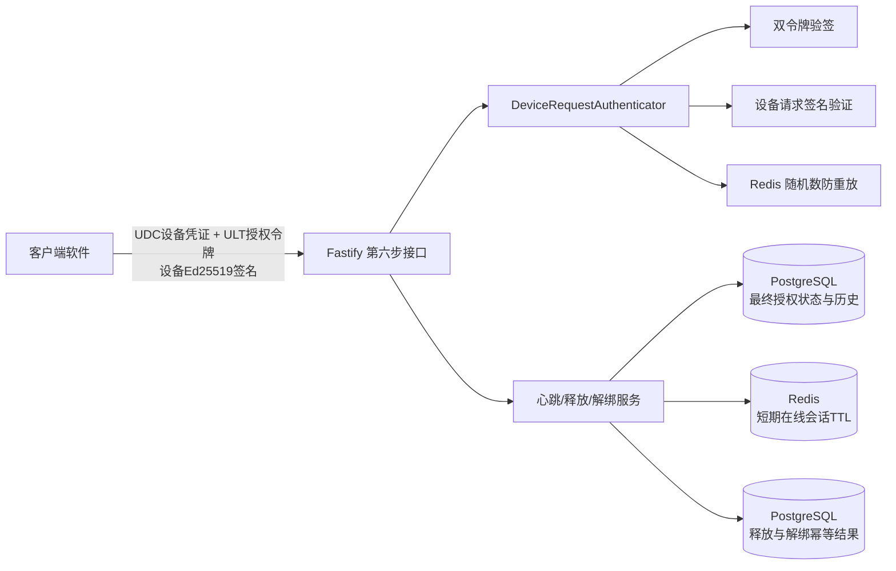
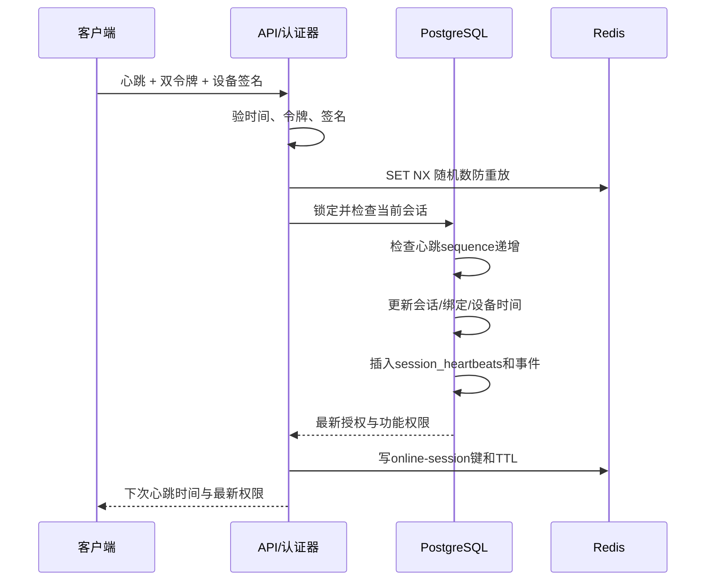
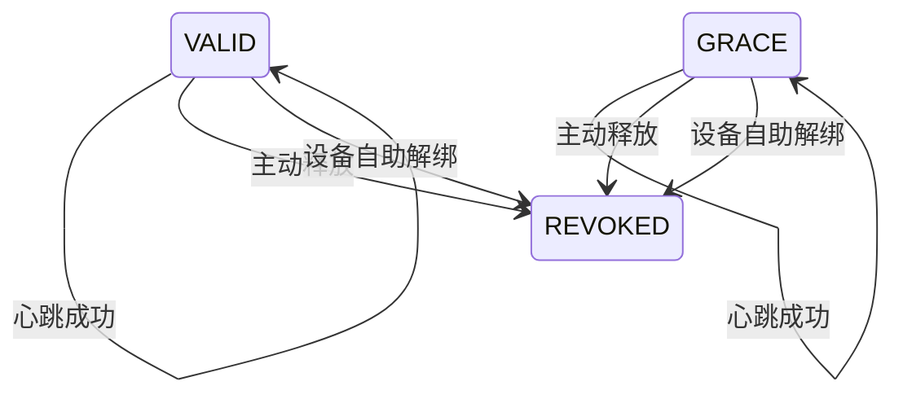
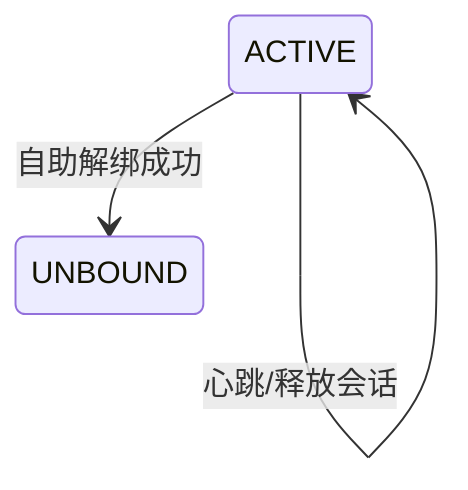

# 通用 Key 授权服务端——第六步：会话心跳、主动释放与设备自助解绑

> 文档版本：V1.0  
> 编制日期：2026-08-24  
> 对应程序版本：0.6.0  
> 当前阶段：第六步，只开发心跳、会话释放和设备自助解绑。

---

## 1. 这一步到底做什么

用最简单的话说，第六步只解决三件事：

1. **心跳**：客户端定时告诉服务端“我还在线”。
2. **释放会话**：用户正常退出软件时，主动让当前登录会话失效。
3. **自助解绑**：Key 明确允许时，用户可以把当前设备从 Key 上解绑。

本步新增三个接口：

```text
POST /api/v1/sessions/heartbeat
POST /api/v1/sessions/release
POST /api/v1/devices/unbind
```

本步绝对不做：

- 管理员强制解绑接口。
- 管理员封禁或解封设备接口。
- 支付、订单、代理商、余额。
- 管理后台网页。
- 签名密钥管理接口。
- 第七步及以后功能。

---

## 2. 总体架构图



### 2.1 谁负责什么

| 模块 | 人话说明 |
|---|---|
| `DeviceRequestAuthenticator` | 先确认令牌、设备、签名、时间戳都是真的 |
| `RequestReplayStore` | 同一个设备随机数不能重复用 |
| `LicenseRuntimeRepository` | PostgreSQL 中检查和修改真实授权状态 |
| `OnlineSessionStore` | Redis 中保存“最近仍在线”的短期标记 |
| `SessionActionIdempotencyStore` | 释放和解绑重复提交时返回同一个结果 |
| `SessionHeartbeatService` | 执行心跳流程 |
| `SessionReleaseService` | 执行当前会话释放流程 |
| `DeviceUnbindService` | 执行受策略控制的设备自助解绑 |

### 2.2 两个数据库各自的地位

- **PostgreSQL 是最终裁决者**：Key、设备、绑定、会话是否有效，都以 PostgreSQL 为准。
- **Redis 只表示短期在线**：Redis 键过期只能说明最近没收到心跳，不能把 Key 或设备永久判定为失效。
- 删除 Redis 在线键不会删除 PostgreSQL 历史。
- Redis 故障不能把已经撤销的 PostgreSQL 会话变回有效。

---

## 3. 三个接口共同的安全规则

三个接口全部复用第五步安全链路，不能绕过：

1. 验证设备凭证 `UDC+JWT` 的 Ed25519 签名。
2. 验证授权令牌 `ULT+JWT` 的 Ed25519 签名。
3. 检查 `kid`、`typ`、`iss`、`aud`、`nbf`、`exp`。
4. 检查两个令牌中的租户、产品、Key、设备、绑定是否一致。
5. 从 PostgreSQL 读取该设备登记的 Ed25519 公钥。
6. 用设备公钥验证本次 HTTP 请求签名。
7. 检查请求时间与服务器时间偏差。
8. Redis 原子占用客户端随机数，防止重放。
9. 再实时检查租户、产品、版本、Key、设备、绑定和会话状态。

共同请求头：

```http
X-Product-Code: demo-product
X-Client-Version: 1.2.0
X-Timestamp: 2026-08-24T12:05:00.000Z
X-Client-Nonce: 每次请求都不同且至少16字符
X-Device-Id: 设备UUID
X-Key-Id: device-key-v1
X-Signature: Base64URL格式的Ed25519签名
```

释放和解绑额外需要：

```http
Idempotency-Key: 至少16字符的唯一请求编号
```

请求签名原文顺序不变，只是允许三个新路径：

```text
v1
POST
请求路径
产品编码
客户端版本
时间戳
客户端随机数
设备ID
设备密钥编号
幂等键或空字符串
请求体规范JSON的SHA-256
```

允许路径：

```text
/api/v1/sessions/heartbeat
/api/v1/sessions/release
/api/v1/devices/unbind
```

---

## 4. 心跳接口

### 4.1 请求

```http
POST /api/v1/sessions/heartbeat
Content-Type: application/json
```

```json
{
  "device_certificate": "UDC+JWT",
  "license_token": "ULT+JWT",
  "client_version": "1.2.0",
  "timestamp": "2026-08-24T12:05:00.000Z",
  "client_nonce": "heartbeat-nonce-123456",
  "sequence": 1
}
```

`sequence` 是当前会话的心跳序号：

- 必须是正整数。
- 第一次可以从 1 开始。
- 后一次必须大于前一次。
- 客户端重启但仍使用同一会话时，也不能把序号退回去。
- 如果已经换了新会话，新会话可以重新从 1 开始。

### 4.2 服务端处理顺序



PostgreSQL 更新：

- `license_sessions.last_heartbeat_at`
- `activations.last_verified_at`
- `devices.last_seen_at`
- 新增一条 `session_heartbeats`，结果为 `ACCEPTED`
- 新增一条 `SESSION_HEARTBEAT_ACCEPTED` 授权事件

Redis 写入：

```text
license-server:online-session:<sessionId>
```

值示例：

```json
{
  "session_id": "会话UUID",
  "license_id": "Key记录UUID",
  "device_id": "设备UUID",
  "activation_id": "绑定UUID",
  "last_heartbeat_at": "2026-08-24T12:05:00.000Z",
  "sequence": 1
}
```

TTL 使用 `SESSION_ONLINE_TTL_SECONDS`。默认心跳间隔 60 秒、在线 TTL 180 秒，也就是大约漏掉三次心跳后在线标记自动消失。

### 4.3 成功返回

```json
{
  "online": true,
  "license_id": "Key记录UUID",
  "device_id": "设备UUID",
  "activation_id": "绑定UUID",
  "session_id": "会话UUID",
  "session_status": "VALID",
  "heartbeat_at": "2026-08-24T12:05:00.000Z",
  "next_heartbeat_at": "2026-08-24T12:06:00.000Z",
  "online_ttl_seconds": 180,
  "should_refresh": false,
  "features": []
}
```

注意：`features` 来自 PostgreSQL 当前数据，不直接相信令牌里的旧快照。

---

## 5. 主动释放会话

### 5.1 请求

```http
POST /api/v1/sessions/release
Idempotency-Key: release-idempotency-123456
```

```json
{
  "device_certificate": "UDC+JWT",
  "license_token": "ULT+JWT",
  "client_version": "1.2.0",
  "timestamp": "2026-08-24T12:05:00.000Z",
  "client_nonce": "release-nonce-123456",
  "idempotency_key": "release-idempotency-123456"
}
```

请求头 `Idempotency-Key` 必须与请求体 `idempotency_key` 完全相同。

### 5.2 释放会改变什么

会改变：

- 当前 `license_sessions.status` 改为 `REVOKED`。
- 当前会话写入 `revoked_at`。
- 删除当前会话 Redis 在线键。
- 写入 `SESSION_RELEASED` 事件。

不会改变：

- 不解绑设备。
- 不删除设备。
- 不删除绑定。
- 不修改 Key 状态。
- 不修改 Key 的 `starts_at` 或 `expires_at`。
- 不撤销同一绑定下的其他会话。

### 5.3 幂等是什么意思

用户点一次“退出”，网络可能断线，客户端不知道服务端到底成功没有，于是会原样重试。

规则：

- 相同动作类型、相同幂等键、相同签名请求内容：返回第一次相同结果。
- 相同幂等键、不同请求内容：返回 `IDEMPOTENCY_CONFLICT`。
- 第一次请求还在处理：返回 `REQUEST_IN_PROGRESS`。
- 释放和解绑即使使用相同字符串的幂等键，也因为动作类型不同而分开保存。

成功返回：

```json
{
  "released": true,
  "license_id": "Key记录UUID",
  "device_id": "设备UUID",
  "activation_id": "绑定UUID",
  "session_id": "会话UUID",
  "session_status": "REVOKED",
  "released_at": "2026-08-24T12:05:00.000Z"
}
```

---

## 6. 设备自助解绑

### 6.1 请求

```http
POST /api/v1/devices/unbind
Idempotency-Key: unbind-idempotency-123456
```

```json
{
  "device_certificate": "UDC+JWT",
  "license_token": "ULT+JWT",
  "client_version": "1.2.0",
  "timestamp": "2026-08-24T12:05:00.000Z",
  "client_nonce": "unbind-nonce-123456",
  "idempotency_key": "unbind-idempotency-123456",
  "reason": "USER_REQUEST"
}
```

第一版 `reason` 只接受 `USER_REQUEST`，不接受任意文本。

### 6.2 两道策略门

#### 第一关：是否允许自助解绑

服务端读取当前 `license_keys.allow_self_unbind`：

- `true`：继续。
- `false`：返回 `SELF_UNBIND_NOT_ALLOWED`。

#### 第二关：冷却期是否结束

第一版采用简单明确的计算：

```text
可解绑时间 = activations.activated_at + license_keys.unbind_cooldown_seconds
```

只有当前服务器时间大于等于可解绑时间，才允许自助解绑。

冷却期未结束时返回：

```json
{
  "code": "UNBIND_COOLDOWN_ACTIVE",
  "data": {
    "retryable": true,
    "details": {
      "available_at": "可以解绑的准确时间",
      "remaining_seconds": 还要等待多少秒
    }
  }
}
```

### 6.3 解绑会改变什么

会改变：

- 当前 `activations.status` 改为 `UNBOUND`。
- 设置 `activations.unbound_at`。
- `unbound_by` 保持空值，表示不是管理员操作。
- 当前绑定下全部 `VALID` / `GRACE` 会话改为 `REVOKED`。
- 这些会话设置 `revoked_at`。
- 删除这些会话对应的 Redis 在线键。
- 写入 `DEVICE_SELF_UNBOUND` 事件。

不会改变：

- 不删除 `devices` 设备记录。
- 不删除 `activations` 绑定历史。
- 不删除 `license_sessions` 会话历史。
- 不创建新绑定。
- 不修改 Key 到期时间。
- 不实现管理员强制解绑。

成功返回：

```json
{
  "unbound": true,
  "license_id": "Key记录UUID",
  "device_id": "设备UUID",
  "activation_id": "绑定UUID",
  "activation_status": "UNBOUND",
  "revoked_session_count": 1,
  "unbound_at": "2026-08-24T12:05:00.000Z"
}
```

解绑成功后，旧设备不能再心跳、验证或刷新。以后是否允许重新激活，由激活阶段的设备数量和业务策略继续裁决。

---

## 7. 状态变化图

### 7.1 会话状态



本步不会把 `REVOKED` 恢复成 `VALID`。

### 7.2 绑定状态



主动释放会话不等于解绑设备，这是两个不同动作。

---

## 8. 数据库迁移

本步只新增：

```text
database/migrations/0005_session_lifecycle_stage.sql
```

迁移做两件事：

1. 给已有 `session_heartbeats` 增加正整数 `sequence` 字段和会话内唯一索引。
2. 新建 `session_action_idempotency_records`，统一保存释放与解绑的幂等状态和结果。

没有修改旧迁移文件：

```text
0001_initial_schema.sql
0002_management_stage.sql
0003_activation_stage.sql
0004_verification_refresh_stage.sql
```

幂等表主键：

```text
(action_type, idempotency_key)
```

动作类型只有：

```text
SESSION_RELEASE
DEVICE_UNBIND
```

---

## 9. 配置说明

第六步新增：

```env
SESSION_ACTION_IDEMPOTENCY_TTL_SECONDS=86400
SESSION_ONLINE_TTL_SECONDS=180
```

继续使用：

```env
HEARTBEAT_INTERVAL_SECONDS=60
REFRESH_AFTER_SECONDS=600
LICENSE_REQUEST_MAX_SKEW_SECONDS=300
REQUEST_REPLAY_TTL_SECONDS=300
```

人话解释：

| 配置 | 说明 |
|---|---|
| `HEARTBEAT_INTERVAL_SECONDS` | 告诉客户端建议多少秒发一次心跳 |
| `SESSION_ONLINE_TTL_SECONDS` | Redis 在线标记没有续命时多少秒自动消失 |
| `SESSION_ACTION_IDEMPOTENCY_TTL_SECONDS` | 释放和解绑结果允许安全重试多久 |
| `REFRESH_AFTER_SECONDS` | 令牌签发多久后建议刷新 |
| `LICENSE_REQUEST_MAX_SKEW_SECONDS` | 客户端时间最多允许偏差多少秒 |
| `REQUEST_REPLAY_TTL_SECONDS` | 相同随机数锁定多久，防止重复提交 |

建议在线 TTL 至少是心跳间隔的 2 到 3 倍。默认是 60 秒心跳、180 秒在线 TTL。

---

## 10. 常见错误码

| 错误码 | 人话解释 |
|---|---|
| `HEARTBEAT_SEQUENCE_INVALID` | 心跳序号没有增加 |
| `SELF_UNBIND_NOT_ALLOWED` | 这个 Key 不允许用户自己解绑 |
| `UNBIND_COOLDOWN_ACTIVE` | 还没到允许解绑的时间 |
| `IDEMPOTENCY_CONFLICT` | 同一个幂等键被拿去做了不同内容的请求 |
| `REQUEST_IN_PROGRESS` | 相同释放或解绑仍在处理中 |
| `REPLAY_DETECTED` | 设备随机数已经用过 |
| `SESSION_REVOKED` | 当前会话已经撤销 |
| `SESSION_EXPIRED` | 当前会话已经过期 |
| `DEVICE_UNBOUND` | 当前设备绑定已经失效 |
| `DEVICE_BLOCKED` | 设备或绑定被封禁 |
| `LICENSE_SUSPENDED` | Key 被冻结 |
| `LICENSE_REVOKED` | Key 被永久吊销 |
| `LICENSE_EXPIRED` | Key 业务期限已到 |

---

## 11. 主要代码位置

```text
src/modules/sessions/session-heartbeat.service.ts
src/modules/sessions/session-release.service.ts
src/modules/sessions/session-lifecycle.routes.ts
src/modules/sessions/online-session.store.ts
src/modules/sessions/infrastructure/redis-online-session.store.ts
src/modules/sessions/infrastructure/in-memory-online-session.store.ts

src/modules/devices/device-unbind.service.ts
src/modules/devices/device-unbind.policy.ts

src/modules/session-actions/session-action-idempotency.store.ts
src/modules/session-actions/infrastructure/postgres-session-action-idempotency.store.ts
src/modules/session-actions/infrastructure/in-memory-session-action-idempotency.store.ts

src/modules/verification/infrastructure/postgres-license-runtime.repository.ts
src/modules/cryptography/ed25519-device-signature-verifier.ts
```

---

## 12. 傻瓜式运行步骤

### 第 1 步：复制配置

如果还没有 `.env`：

```powershell
Copy-Item .env.example .env
```

### 第 2 步：确认第六步配置

打开 `.env`，确认存在：

```env
HEARTBEAT_INTERVAL_SECONDS=60
SESSION_ONLINE_TTL_SECONDS=180
SESSION_ACTION_IDEMPOTENCY_TTL_SECONDS=86400
```

### 第 3 步：启动 PostgreSQL 和 Redis

```powershell
pnpm infra:up
```

### 第 4 步：执行数据库迁移

```powershell
pnpm db:migrate
pnpm db:status
```

必须看到 `0005_session_lifecycle_stage.sql` 已应用。

### 第 5 步：启动服务

```powershell
pnpm dev
```

### 第 6 步：检查程序

```powershell
pnpm typecheck
pnpm test
pnpm build
```

---

## 13. 第六步验收清单

- [x] 有中文傻瓜式设计文档和架构图。
- [x] 心跳接口复用双令牌和设备签名认证。
- [x] 心跳使用 Redis 随机数防重放。
- [x] 心跳实时检查 PostgreSQL 授权状态。
- [x] 心跳更新会话、绑定和设备时间。
- [x] 心跳写入 `session_heartbeats`。
- [x] 心跳维护 Redis 在线会话 TTL。
- [x] 会话释放只撤销当前会话。
- [x] 会话释放删除 Redis 在线标记。
- [x] 会话释放支持幂等重试。
- [x] 自助解绑检查允许开关。
- [x] 自助解绑检查冷却期。
- [x] 自助解绑撤销该绑定全部有效会话。
- [x] 自助解绑保留设备、绑定和会话历史。
- [x] 自助解绑不修改 Key 到期时间。
- [x] 自助解绑支持幂等重试。
- [x] 管理员解绑、封禁、支付和管理页面仍未实现。

---

## 14. 下一步边界

第六步到此结束。没有明确收到下一步命令前，不开发管理员设备接口、支付订单、代理商、管理后台、密钥管理或任何第七步功能。
