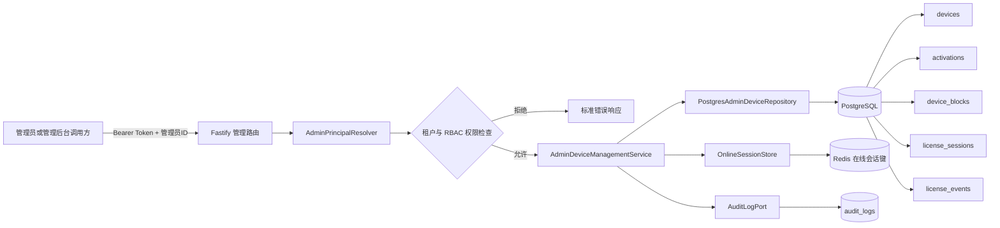
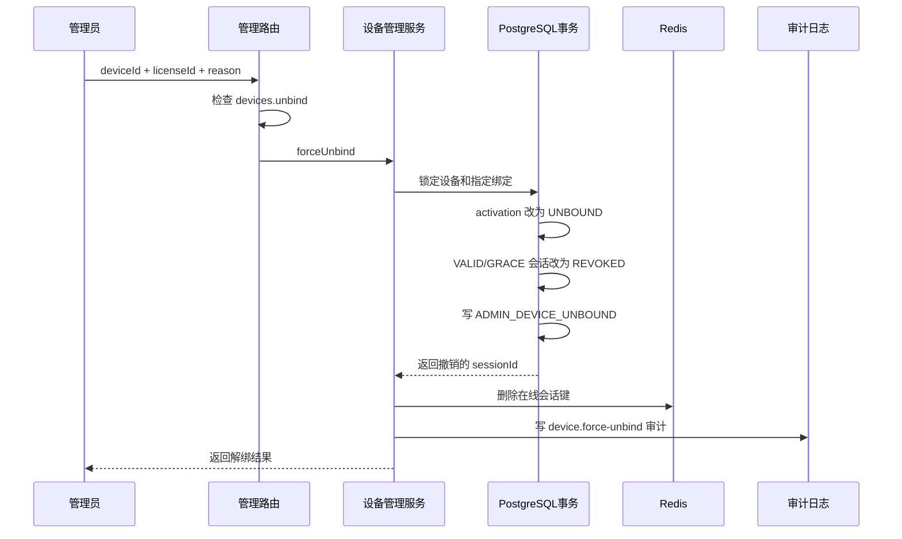
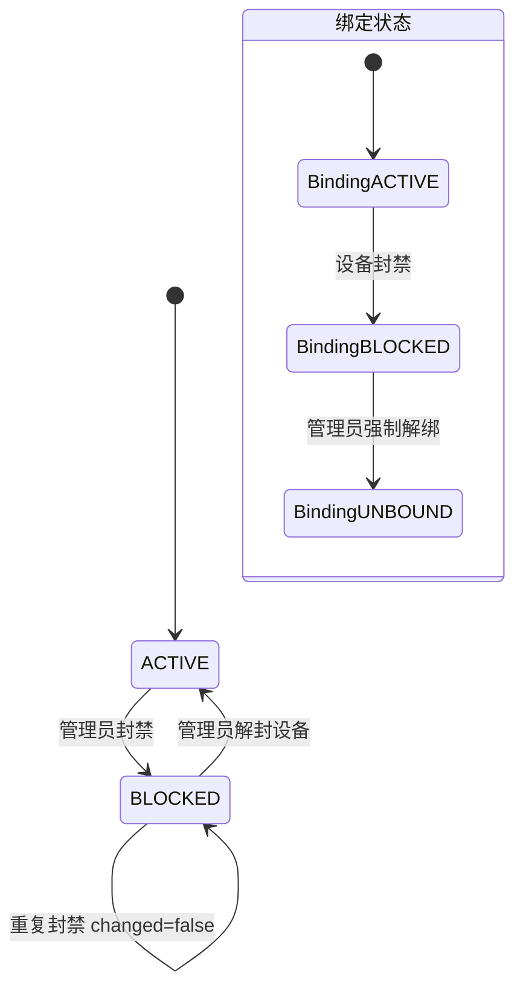

# 第七步：管理员设备查询、强制解绑、封禁与解封设计

> 当前实现版本：`0.7.0`  
> 本文只说明第七步。看不懂代码也没关系，按照“傻瓜式操作”章节执行即可。

---

## 1. 第七步只做什么

第七步只增加管理员设备管理，不增加最终用户的新功能。

本步完成 4 个管理接口：

```text
GET  /admin/v1/license-keys/{licenseId}/devices
POST /admin/v1/devices/{deviceId}/unbind
POST /admin/v1/devices/{deviceId}/block
POST /admin/v1/devices/{deviceId}/unblock
```

它们分别用于：

1. 查看某个 Key 的全部设备绑定历史。
2. 管理员跳过“是否允许自助解绑”和“解绑冷却期”，强制解绑指定 Key 的指定设备。
3. 封禁一个设备，同时封禁这个设备仍为 `ACTIVE` 的绑定并撤销在线会话。
4. 解除设备封禁，但绝不自动恢复旧绑定、旧令牌或旧会话。

### 1.1 本步明确不做

以下内容仍然不存在：

- 支付接口。
- 订单接口。
- 代理商接口。
- 管理后台网页。
- 签名密钥管理接口。
- 新的最终用户公开接口。
- 第八步及以后功能。

---

## 2. 一句话理解

把授权服务器想成门卫系统：

- **查看设备**：管理员查看某张门卡以前在哪些设备上使用过。
- **强制解绑**：管理员把“这张门卡和这台设备”的关系剪断。
- **封禁设备**：管理员把整台设备拉入黑名单，它绑定的有效门卡和在线通行证一起失效。
- **解封设备**：只把设备移出黑名单；以前已封禁的绑定和已撤销的通行证不会复活。

---

## 3. 总体架构图



### 3.1 模块职责

| 模块 | 只负责什么 |
|---|---|
| `admin-device.routes.ts` | 接收 HTTP 请求、校验参数、检查权限、格式化响应 |
| `admin-device-management.service.ts` | 编排数据库操作、Redis 清理和管理员审计 |
| `admin-device.repository.ts` | 定义设备管理数据结构和仓储接口 |
| `postgres-admin-device.repository.ts` | 在 PostgreSQL 事务中修改设备、绑定、封禁和会话状态 |
| `OnlineSessionStore` | 删除已撤销会话对应的 Redis 在线标记 |
| `AuditLogPort` | 写管理员操作审计日志 |

路由不直接写 SQL，服务不直接依赖 PostgreSQL 客户端，所以以后替换存储实现时不会把整个项目拆掉重写。

---

## 4. 管理认证和权限

所有第七步接口都属于管理接口，必须使用：

```http
Authorization: Bearer <MANAGEMENT_GATEWAY_TOKEN>
X-Admin-User-Id: <管理员 UUID>
```

租户管理员只能操作自己的租户。

平台管理员的 `tenantId` 为 `null`，调用租户资源时还必须提供：

```http
X-Tenant-Id: <目标租户 UUID>
```

### 4.1 权限对应表

| 操作 | 必须拥有的权限 |
|---|---|
| 查看某个 Key 的设备 | `devices.read` |
| 管理员强制解绑 | `devices.unbind` |
| 封禁设备 | `devices.block` |
| 解封设备 | `devices.block` |

权限不足统一返回：

```json
{
  "success": false,
  "code": "ADMIN_FORBIDDEN",
  "message": "没有执行此操作的权限"
}
```

### 4.2 租户隔离

每一次查询或修改都同时携带：

```text
tenant_id + license_id / device_id
```

只知道别的租户的设备 UUID 没有用。SQL 不会只按设备 UUID 修改数据，避免跨租户越权。

---

## 5. 接口一：查看某个 Key 的设备

### 5.1 请求

```http
GET /admin/v1/license-keys/{licenseId}/devices?limit=50&offset=0
```

可选过滤：

```http
GET /admin/v1/license-keys/{licenseId}/devices?activation_status=ACTIVE
```

`activation_status` 可选值：

```text
ACTIVE
UNBOUND
BLOCKED
REPLACED
```

### 5.2 返回内容

返回的是绑定历史，不只返回当前有效绑定：

```json
{
  "success": true,
  "data": {
    "items": [
      {
        "device_id": "设备UUID",
        "license_id": "Key记录UUID",
        "activation_id": "绑定UUID",
        "device_status": "ACTIVE",
        "activation_status": "ACTIVE",
        "platform": "windows",
        "os_version": "11",
        "display_name": "办公室电脑",
        "device_public_key_fingerprint": "设备公钥指纹",
        "fingerprint_hash": "设备特征摘要",
        "risk_score": 0,
        "active_session_count": 1,
        "blocked": false,
        "block_reason": null
      }
    ],
    "limit": 50,
    "offset": 0
  }
}
```

### 5.3 重要说明

- 不返回设备私钥，因为服务端从来没有设备私钥。
- 不删除 `UNBOUND`、`BLOCKED` 或 `REPLACED` 历史。
- `active_session_count` 只统计 `VALID` 和 `GRACE` 会话。
- Key 不存在或不属于当前租户时返回 `LICENSE_NOT_FOUND`。

---

## 6. 接口二：管理员强制解绑

### 6.1 请求

```http
POST /admin/v1/devices/{deviceId}/unbind
Content-Type: application/json
```

```json
{
  "license_id": "要解绑的Key记录UUID",
  "reason": "用户申请换机"
}
```

为什么请求体还要传 `license_id`？

因为同一设备可能用过多个 Key。管理员必须明确剪断哪一个 Key 和设备的绑定，不能误伤其他授权。

### 6.2 执行顺序



### 6.3 与第六步自助解绑的区别

| 规则 | 用户自助解绑 | 管理员强制解绑 |
|---|---|---|
| 认证 | 设备凭证、授权令牌、设备签名 | 管理 Bearer Token、管理员身份、RBAC |
| `allow_self_unbind` | 必须为 `true` | 不检查 |
| 冷却期 | 必须满足 | 不检查 |
| 权限 | 当前已认证设备 | `devices.unbind` |
| 审计 | 授权事件 | 授权事件 + 管理员审计 |

### 6.4 数据变化

会改变：

- 指定 `activations.status` 改为 `UNBOUND`。
- 写入 `unbound_at`。
- 写入 `unbound_by`。
- 该绑定的 `VALID` / `GRACE` 会话改为 `REVOKED`。
- 写入 `ADMIN_DEVICE_UNBOUND` 授权事件。
- 写入 `device.force-unbind` 管理审计。
- 删除对应 Redis 在线状态。

不会改变：

- 不删除设备。
- 不删除绑定历史。
- 不删除会话历史。
- 不修改 Key 到期时间。
- 不解绑同一设备上的其他 Key。

### 6.5 成功返回

```json
{
  "unbound": true,
  "changed": true,
  "license_id": "Key记录UUID",
  "device_id": "设备UUID",
  "activation_id": "绑定UUID",
  "activation_status": "UNBOUND",
  "revoked_session_count": 2,
  "unbound_at": "2026-08-24T14:00:00.000Z"
}
```

重复操作已经解绑的绑定不会删除历史，会返回：

```json
{
  "unbound": true,
  "changed": false
}
```

---

## 7. 接口三：封禁设备

### 7.1 请求

```http
POST /admin/v1/devices/{deviceId}/block
Content-Type: application/json
```

```json
{
  "reason": "设备被盗"
}
```

`reason` 必填，长度为 1 到 255 个字符，方便以后审计时知道为什么封禁。

### 7.2 封禁范围

设备封禁是租户内的设备级封禁，不只是某一个 Key：

1. `devices.status` 改为 `BLOCKED`。
2. 建立一条 `device_blocks` 活跃封禁记录。
3. 封禁记录同时保存 `device_id` 和 `fingerprint_hash`。
4. 该设备所有仍为 `ACTIVE` 的绑定改为 `BLOCKED`。
5. 该设备所有 `VALID` / `GRACE` 会话改为 `REVOKED`。
6. 删除被撤销会话的 Redis 在线键。
7. 对受影响绑定写 `ADMIN_DEVICE_BLOCKED` 授权事件。
8. 写 `device.block` 管理员审计。

同时保存 `device_id` 和设备指纹摘要，是为了防止只更换设备公钥后绕过黑名单。

### 7.3 封禁状态图



设备解封只改变设备黑名单状态，图中的 `BindingBLOCKED` 不会自动回到 `BindingACTIVE`。

### 7.4 成功返回

```json
{
  "blocked": true,
  "changed": true,
  "device_id": "设备UUID",
  "device_status": "BLOCKED",
  "block_id": "封禁记录UUID",
  "blocked_activation_count": 2,
  "revoked_session_count": 3,
  "blocked_at": "2026-08-24T14:00:00.000Z"
}
```

---

## 8. 接口四：解封设备

### 8.1 请求

```http
POST /admin/v1/devices/{deviceId}/unblock
Content-Type: application/json
```

```json
{
  "reason": "人工核验通过"
}
```

### 8.2 解封到底恢复什么

只恢复：

- 活跃 `device_blocks` 改为 `RELEASED`。
- 写入 `released_by` 和 `released_at`。
- 如果设备状态是 `BLOCKED`，改回 `ACTIVE`。
- 写 `ADMIN_DEVICE_UNBLOCKED` 授权事件。
- 写 `device.unblock` 管理员审计。

绝不恢复：

- 不把旧 `BLOCKED` 绑定改回 `ACTIVE`。
- 不把旧 `REVOKED` 会话改回 `VALID`。
- 不重新签发令牌。
- 不修改 Key 到期时间。

成功响应会明确告诉调用方：

```json
{
  "unblocked": true,
  "changed": true,
  "device_status": "ACTIVE",
  "released_block_count": 1,
  "old_bindings_restored": false,
  "old_sessions_restored": false
}
```

这样可以防止管理后台误以为“点了解封，旧授权就全部复活”。

---

## 9. 数据库设计

第七步没有重复创建旧表，因为第二步已经准备好了：

```text
devices
activations
device_blocks
license_sessions
license_events
audit_logs
```

新增迁移：

```text
database/migrations/0006_admin_device_management_stage.sql
```

迁移只增加管理员查询和操作所需索引：

```text
activations_tenant_license_time_idx
activations_tenant_device_status_idx
device_blocks_tenant_device_status_idx
```

### 9.1 为什么必须用事务

强制解绑或封禁不能只改一张表。例如封禁过程中如果只改了设备状态，服务器突然中断，会留下半完成数据。

PostgreSQL 事务保证：

```text
设备状态 + 绑定状态 + 会话撤销 + license_events
```

要么一起成功，要么一起回滚。

设备记录会先 `FOR UPDATE` 锁定。同一设备的两个管理员操作会排队执行，避免同时封禁和解封造成状态互相覆盖。

### 9.2 为什么不删除记录

授权系统首先要可追溯，所以：

```text
DELETE devices       禁止
DELETE activations   禁止
DELETE device_blocks 禁止
DELETE sessions      禁止
```

解绑、封禁、解封都通过状态和时间字段表达历史。

---

## 10. PostgreSQL 和 Redis 的分工

### PostgreSQL

PostgreSQL 是最终真相，保存：

- 设备是否封禁。
- 绑定是否有效。
- 会话是否撤销。
- 授权事件。
- 管理员审计。

### Redis

Redis 只保存短期在线状态：

```text
online-session:<sessionId>
```

强制解绑和封禁后，服务会立即删除被撤销会话的在线键。

即使 Redis 临时异常，客户端下一次验证仍然必须经过 PostgreSQL 实时状态检查，不能靠 Redis 把已撤销授权变回有效。

---

## 11. 事件和审计

### 11.1 授权状态事件 `license_events`

| 事件名 | 含义 |
|---|---|
| `ADMIN_DEVICE_UNBOUND` | 管理员强制解绑一个 Key 与设备的绑定 |
| `ADMIN_DEVICE_BLOCKED` | 管理员封禁设备及其有效绑定 |
| `ADMIN_DEVICE_UNBLOCKED` | 管理员解除设备黑名单 |

事件元数据包含管理员 ID、原因、是否真实发生状态变化以及会话撤销数量。

### 11.2 管理操作审计 `audit_logs`

| action | resource_type |
|---|---|
| `device.force-unbind` | `DEVICE` |
| `device.block` | `DEVICE` |
| `device.unblock` | `DEVICE` |

审计保存：

- 谁操作。
- 操作哪个租户。
- 操作哪个设备。
- 请求 ID。
- 来源 IP。
- User-Agent。
- 操作前状态。
- 操作后状态。
- 原因和影响数量。

---

## 12. 错误码

| 错误码 | HTTP | 含义 |
|---|---:|---|
| `ADMIN_FORBIDDEN` | 403 | 缺少相应设备管理权限 |
| `TENANT_ACCESS_DENIED` | 403 | 租户管理员试图操作其他租户 |
| `TENANT_REQUIRED` | 400 | 平台管理员没有指定目标租户 |
| `LICENSE_NOT_FOUND` | 404 | Key 不存在或不属于当前租户 |
| `DEVICE_NOT_FOUND` | 404 | 设备不存在或不属于当前租户 |
| `DEVICE_BINDING_NOT_FOUND` | 404 | 指定 Key 和设备之间没有绑定历史 |
| `DEVICE_BINDING_NOT_UNBINDABLE` | 409 | 已被换机替代的绑定不能再次解绑 |
| `DEVICE_DISABLED` | 409 | 已停用设备不能被改写成封禁状态 |
| `INVALID_REQUEST` | 400 | UUID、分页、状态或原因格式不正确 |

---

## 13. 傻瓜式操作

### 第 1 步：迁移数据库

```powershell
pnpm db:migrate
pnpm db:status
```

应该看到 `0006_admin_device_management_stage.sql` 已应用。

### 第 2 步：启动服务

```powershell
pnpm dev
```

### 第 3 步：准备变量

```powershell
$BaseUrl = 'http://127.0.0.1:3000'
$Token = '把.env里的MANAGEMENT_GATEWAY_TOKEN填这里'
$AdminId = '管理员UUID'
$LicenseId = 'Key记录UUID'
$DeviceId = '设备UUID'

$Headers = @{
  Authorization = "Bearer $Token"
  'X-Admin-User-Id' = $AdminId
}
```

平台管理员再加：

```powershell
$Headers['X-Tenant-Id'] = '目标租户UUID'
```

### 第 4 步：查看设备

```powershell
Invoke-RestMethod `
  -Method Get `
  -Uri "$BaseUrl/admin/v1/license-keys/$LicenseId/devices" `
  -Headers $Headers
```

### 第 5 步：强制解绑

```powershell
Invoke-RestMethod `
  -Method Post `
  -Uri "$BaseUrl/admin/v1/devices/$DeviceId/unbind" `
  -Headers $Headers `
  -ContentType 'application/json' `
  -Body (@{
    license_id = $LicenseId
    reason = '用户申请换机'
  } | ConvertTo-Json)
```

### 第 6 步：封禁设备

```powershell
Invoke-RestMethod `
  -Method Post `
  -Uri "$BaseUrl/admin/v1/devices/$DeviceId/block" `
  -Headers $Headers `
  -ContentType 'application/json' `
  -Body (@{ reason = '设备被盗' } | ConvertTo-Json)
```

### 第 7 步：解封设备

```powershell
Invoke-RestMethod `
  -Method Post `
  -Uri "$BaseUrl/admin/v1/devices/$DeviceId/unblock" `
  -Headers $Headers `
  -ContentType 'application/json' `
  -Body (@{ reason = '人工核验通过' } | ConvertTo-Json)
```

### 第 8 步：检查代码

```powershell
pnpm typecheck
pnpm test
pnpm build
```

---

## 14. 文件清单

第七步新增：

```text
07-管理员设备查询解绑封禁与解封设计.md

database/migrations/0006_admin_device_management_stage.sql

src/modules/admin-devices/admin-device.repository.ts
src/modules/admin-devices/admin-device-management.service.ts
src/modules/admin-devices/admin-device.routes.ts
src/modules/admin-devices/infrastructure/postgres-admin-device.repository.ts

tests/admin-device-management.service.test.ts
tests/admin-device.routes.test.ts
tests/admin-device-migration.test.ts
```

第七步接入修改：

```text
src/app.ts
src/server.ts
src/infrastructure/runtime/runtime-infrastructure.ts
src/modules/health/health.routes.ts
package.json
README.md
```

---

## 15. 验收清单

- [x] `devices.read` 才能查看设备绑定。
- [x] `devices.unbind` 才能强制解绑。
- [x] `devices.block` 才能封禁或解封。
- [x] 所有数据库操作都有租户条件。
- [x] 强制解绑把指定绑定改为 `UNBOUND`。
- [x] 强制解绑撤销该绑定全部有效会话。
- [x] 封禁设备创建活跃 `device_blocks` 记录。
- [x] 封禁设备把有效绑定改为 `BLOCKED`。
- [x] 封禁设备撤销相关有效会话。
- [x] 解封不会恢复旧绑定和旧会话。
- [x] Redis 在线状态会被清理。
- [x] 写入 `license_events`。
- [x] 写入 `audit_logs`。
- [x] 不删除设备、绑定、封禁或会话历史。
- [x] 不修改 Key 到期时间。
- [x] 支付、订单、代理商、管理页面和密钥管理仍为 404。

---

## 16. 下一步边界

第七步到此结束。

没有收到明确的下一步命令前，不开发：

- 支付和订单。
- 代理商体系。
- 管理后台页面。
- 签名密钥管理接口。
- 第八步及以后功能。
