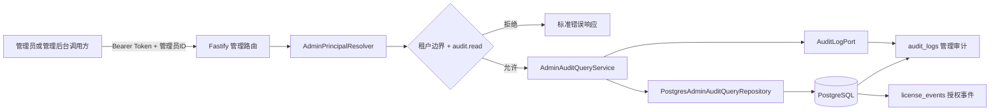
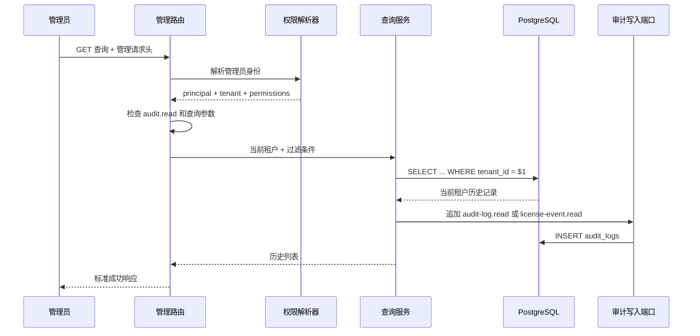

# 第八步：管理员审计日志与授权事件查询设计

> 当前实现版本：`0.8.0`  
> 本文只说明第八步。不会写代码也没关系，直接照着“傻瓜式操作”章节复制命令即可。

---

## 1. 第八步只做什么

第八步只增加“查历史记录”的管理接口，不增加新的授权状态修改能力。

本步完成 2 个只读接口：

```text
GET /admin/v1/audit-logs
GET /admin/v1/license-events
```

它们分别用于：

1. 查看管理员和系统执行过什么敏感操作，例如谁封禁了设备、谁吊销了 Key。
2. 查看授权运行过程发生过什么事件，例如激活、验证、刷新、心跳、解绑、封禁和解封。

### 1.1 一句话理解

把授权服务器想成一栋办公楼：

- `audit_logs` 是“保安操作记录本”，记录哪个管理员做了什么管理动作。
- `license_events` 是“门禁通行记录本”，记录 Key、设备和会话发生过什么授权事件。
- 第八步只允许翻阅记录本，不允许撕页、改字或删除历史。

### 1.2 本步明确不做

以下内容仍然不存在：

- 删除或修改审计日志。
- 删除或修改授权事件。
- 审计日志导出文件。
- 统计图表和管理后台网页。
- 支付和订单接口。
- 代理商体系。
- 签名密钥管理接口。
- 系统设置管理接口。
- 第九步及以后功能。

---

## 2. 为什么第八步开发这个模块

前七步已经持续向以下两张表写入历史：

```text
audit_logs
license_events
```

第二步也已经预留：

```text
audit.read
```

如果只能写不能查，管理员遇到问题时无法回答：

- 谁封禁了这台设备？
- 某个 Key 为什么突然不能用了？
- 某次失败请求对应哪个 `request_id`？
- 某个时间段发生过哪些授权事件？
- 操作前后状态分别是什么？

所以第八步把已经存在的历史数据安全地开放为只读管理接口。

---

## 3. 总体架构图



说明：

1. 路由先认证管理员。
2. 再确认管理员拥有 `audit.read`。
3. 再确认目标租户正确。
4. 服务把当前租户 ID 强制加入查询条件。
5. PostgreSQL 只返回该租户的历史。
6. 查询成功后，再写一条“谁读取了敏感历史”的审计记录。

### 3.1 模块职责

| 模块 | 只负责什么 |
|---|---|
| `admin-audit.routes.ts` | 解析查询参数、检查权限、输出蛇形字段响应 |
| `admin-audit-query.service.ts` | 强制使用当前租户并记录读取行为 |
| `admin-audit-query.repository.ts` | 定义审计日志、授权事件和过滤条件 |
| `postgres-admin-audit-query.repository.ts` | 执行参数化、租户隔离、只读 PostgreSQL 查询 |
| `AuditLogPort` | 把本次敏感读取动作追加到 `audit_logs` |

路由不写 SQL，服务不创建数据库连接，仓储不处理 HTTP。

---

## 4. 管理认证和权限

两个接口都必须使用管理认证：

```http
Authorization: Bearer <MANAGEMENT_GATEWAY_TOKEN>
X-Admin-User-Id: <管理员 UUID>
```

租户管理员只能读取自己的租户。

平台管理员的 `tenantId` 为 `null`，读取某个租户时必须额外提供：

```http
X-Tenant-Id: <目标租户 UUID>
```

### 4.1 权限表

| 操作 | 必须拥有的权限 |
|---|---|
| 查看管理员审计日志 | `audit.read` |
| 查看授权事件 | `audit.read` |

没有权限返回：

```json
{
  "success": false,
  "code": "ADMIN_FORBIDDEN",
  "message": "没有执行此操作的权限"
}
```

租户管理员伪造其他 `X-Tenant-Id` 返回：

```text
TENANT_ACCESS_DENIED
```

平台管理员没有指定目标租户返回：

```text
TENANT_REQUIRED
```

客户端设备签名、设备凭证和授权令牌不能用于这两个管理接口。

---

## 5. 接口一：查看管理员审计日志

### 5.1 请求

```http
GET /admin/v1/audit-logs?limit=50&offset=0
```

### 5.2 可选过滤条件

| 参数 | 说明 | 示例 |
|---|---|---|
| `actor_type` | 操作人类型 | `ADMIN_USER` |
| `actor_id` | 操作人 UUID | 管理员 ID |
| `action` | 精确操作名称 | `device.block` |
| `resource_type` | 资源类型 | `DEVICE` |
| `resource_id` | 资源 ID | 设备 UUID |
| `result` | 执行结果 | `SUCCESS` 或 `FAILURE` |
| `request_id` | 请求追踪 ID | `req-123` |
| `occurred_from` | 起始时间，ISO 8601 | `2026-08-01T00:00:00Z` |
| `occurred_to` | 截止时间，ISO 8601 | `2026-08-24T23:59:59Z` |
| `limit` | 每页数量，1 到 100 | 默认 `50` |
| `offset` | 跳过数量，不能小于 0 | 默认 `0` |

`occurred_from` 不能晚于 `occurred_to`。

### 5.3 完整例子

```http
GET /admin/v1/audit-logs?action=device.block&result=SUCCESS&occurred_from=2026-08-01T00:00:00Z&limit=20&offset=0
```

### 5.4 成功响应

```json
{
  "request_id": "req-audit-001",
  "success": true,
  "code": "OK",
  "message": "管理员审计日志读取成功",
  "server_time": "2026-08-24T15:00:00.000Z",
  "data": {
    "items": [
      {
        "id": "101",
        "tenant_id": "11111111-1111-4111-8111-111111111111",
        "actor_type": "ADMIN_USER",
        "actor_id": "aaaaaaaa-aaaa-4aaa-8aaa-aaaaaaaaaaaa",
        "action": "device.block",
        "resource_type": "DEVICE",
        "resource_id": "22222222-2222-4222-8222-222222222222",
        "request_id": "req-old-001",
        "source_ip": "127.0.0.1",
        "user_agent": "PowerShell",
        "result": "SUCCESS",
        "before_data": {
          "device_status": "ACTIVE"
        },
        "after_data": {
          "device_status": "BLOCKED"
        },
        "metadata": {
          "reason": "风险设备"
        },
        "occurred_at": "2026-08-24T14:00:00.000Z"
      }
    ],
    "limit": 20,
    "offset": 0
  }
}
```

说明：

- PostgreSQL 的 `BIGSERIAL` ID 以字符串返回，避免 JavaScript 大整数精度丢失。
- `before_data` 和 `after_data` 用来查看操作前后状态。
- 旧记录字段本来为空时，响应返回 `null`，不会伪造数据。

---

## 6. 接口二：查看授权事件

### 6.1 请求

```http
GET /admin/v1/license-events?limit=50&offset=0
```

### 6.2 可选过滤条件

| 参数 | 说明 |
|---|---|
| `product_id` | 产品 UUID |
| `license_id` | Key 数据库 UUID，不是 Key 明文 |
| `device_id` | 设备 UUID |
| `activation_id` | 激活绑定 UUID |
| `session_id` | 会话 UUID |
| `event_type` | 精确事件类型，例如 `ADMIN_DEVICE_BLOCKED` |
| `result` | `SUCCESS` 或 `FAILURE` |
| `reason_code` | 精确原因码 |
| `request_id` | 请求追踪 ID |
| `occurred_from` | 起始时间，ISO 8601 |
| `occurred_to` | 截止时间，ISO 8601 |
| `limit` | 每页数量，1 到 100，默认 50 |
| `offset` | 跳过数量，默认 0 |

### 6.3 完整例子

```http
GET /admin/v1/license-events?license_id=44444444-4444-4444-8444-444444444444&device_id=55555555-5555-4555-8555-555555555555&event_type=ADMIN_DEVICE_BLOCKED
```

### 6.4 成功响应

```json
{
  "request_id": "req-event-001",
  "success": true,
  "code": "OK",
  "message": "授权事件读取成功",
  "server_time": "2026-08-24T15:00:00.000Z",
  "data": {
    "items": [
      {
        "id": "202",
        "tenant_id": "11111111-1111-4111-8111-111111111111",
        "product_id": "33333333-3333-4333-8333-333333333333",
        "license_id": "44444444-4444-4444-8444-444444444444",
        "device_id": "55555555-5555-4555-8555-555555555555",
        "activation_id": "66666666-6666-4666-8666-666666666666",
        "session_id": null,
        "event_type": "ADMIN_DEVICE_BLOCKED",
        "result": "SUCCESS",
        "reason_code": "ADMIN_BLOCKED",
        "request_id": "req-event-old",
        "ip_address": "127.0.0.1",
        "metadata": {
          "reason": "风险设备"
        },
        "occurred_at": "2026-08-24T14:00:00.000Z"
      }
    ],
    "limit": 50,
    "offset": 0
  }
}
```

### 6.5 Key 安全规则

接口只接受 `license_id`，不接受 Key 明文。

因此管理员不能通过该接口提交或搜索：

```text
ABCD-EFGH-IJKL-MNOP
```

数据库仍然只保存 Key 哈希、前缀和后缀，第八步没有改变此前的 Key 安全设计。

---

## 7. 查询顺序图



为什么读取也要写审计：

- 审计内容本身可能包含 IP、管理员 ID 和状态变化。
- 谁查看过敏感历史，也属于应该留痕的安全行为。
- 本次读取日志在查询完成后追加，所以不会突然插入当前返回列表中。

---

## 8. PostgreSQL 查询规则

### 8.1 强制租户条件

所有查询从下面的条件开始：

```sql
WHERE tenant_id = $1
```

其他过滤条件只会继续追加：

```sql
AND action = $2
AND result = $3
```

不会使用字符串拼接用户输入，值全部通过 PostgreSQL 参数传递。

### 8.2 稳定排序

统一使用：

```sql
ORDER BY occurred_at DESC, id DESC
```

先看最新记录；如果两条记录时间相同，再按 ID 倒序，避免分页顺序随机变化。

### 8.3 分页限制

```text
limit  最小 1，最大 100，默认 50
offset 最小 0，默认 0
```

第八步不做“无上限一次性拉取”，避免大表查询拖垮服务。

### 8.4 历史保留

第八步仓储只有：

```sql
SELECT
```

没有：

```sql
UPDATE
DELETE
TRUNCATE
DROP
```

查询后的审计留痕通过已经存在的 `AuditLogPort` 追加新记录，不修改旧记录。

---

## 9. 第八步数据库迁移

新增迁移：

```text
database/migrations/0007_admin_audit_query_stage.sql
```

它不重建旧表，只增加查询索引：

```text
audit_logs_tenant_action_time_idx
audit_logs_tenant_result_time_idx
license_events_tenant_license_time_idx
license_events_tenant_device_time_idx
license_events_tenant_type_time_idx
```

作用：

- 按动作查询管理员审计更快。
- 按成功或失败查询更快。
- 按 Key、设备和事件类型查询授权事件更快。
- 继续按租户和时间范围缩小查询数据。

严禁修改已经应用的：

```text
0001_initial_schema.sql
0002_management_stage.sql
0003_activation_stage.sql
0004_verification_refresh_stage.sql
0005_session_lifecycle_stage.sql
0006_admin_device_management_stage.sql
```

---

## 10. 错误处理

| 情况 | HTTP | 错误码 |
|---|---:|---|
| 管理认证失败 | 401 | 管理认证对应错误码 |
| 缺少 `audit.read` | 403 | `ADMIN_FORBIDDEN` |
| 访问其他租户 | 403 | `TENANT_ACCESS_DENIED` |
| 平台管理员没指定租户 | 400 | `TENANT_REQUIRED` |
| UUID 格式错误 | 400 | `INVALID_REQUEST` |
| 时间格式错误 | 400 | `INVALID_REQUEST` |
| 起始时间晚于截止时间 | 400 | `INVALID_REQUEST` |
| `limit` 超过 100 | 400 | `INVALID_REQUEST` |
| 范围外路由 | 404 | `ROUTE_NOT_FOUND` |

错误响应仍使用项目统一格式，不把 SQL 或服务器内部堆栈直接返回给调用方。

---

## 11. 安全约束

1. 只有 `audit.read` 可以读取两类历史。
2. 租户 ID 由认证上下文决定，不从普通查询参数信任。
3. 平台管理员必须明确指定目标租户。
4. SQL 始终参数化。
5. 单页最多 100 条。
6. 只使用内部 UUID 过滤 Key，不接收 Key 明文。
7. 返回历史中不新增设备私钥、签名私钥或完整授权令牌字段。
8. 不删除、不修改任何旧审计和旧授权事件。
9. 敏感读取动作本身写入 `audit_logs`。
10. 已应用旧迁移保持不变。

---

## 12. 傻瓜式操作

下面命令在项目根目录运行。

### 第 1 步：进入目录

```powershell
Set-Location "C:\Users\WDDN\Desktop\授权服务器源码"
```

### 第 2 步：更新数据库

先启动 PostgreSQL 和 Redis：

```powershell
pnpm infra:up
```

再执行迁移：

```powershell
pnpm db:migrate
pnpm db:status
```

状态中应当看到：

```text
0007_admin_audit_query_stage.sql
```

### 第 3 步：启动服务器

```powershell
pnpm dev
```

### 第 4 步：准备管理请求头

租户管理员：

```powershell
$BaseUrl = 'http://127.0.0.1:3000'
$Headers = @{
  Authorization = 'Bearer 这里填写MANAGEMENT_GATEWAY_TOKEN'
  'X-Admin-User-Id' = '这里填写管理员UUID'
}
```

平台管理员还要指定目标租户：

```powershell
$Headers['X-Tenant-Id'] = '这里填写目标租户UUID'
```

### 第 5 步：查看最近的管理员审计

```powershell
Invoke-RestMethod `
  -Method Get `
  -Uri "$BaseUrl/admin/v1/audit-logs?limit=20&offset=0" `
  -Headers $Headers
```

### 第 6 步：只看设备封禁操作

```powershell
Invoke-RestMethod `
  -Method Get `
  -Uri "$BaseUrl/admin/v1/audit-logs?action=device.block&result=SUCCESS" `
  -Headers $Headers
```

### 第 7 步：查看某个 Key 的授权事件

```powershell
$LicenseId = '这里填写Key的数据库UUID'

Invoke-RestMethod `
  -Method Get `
  -Uri "$BaseUrl/admin/v1/license-events?license_id=$LicenseId&limit=50&offset=0" `
  -Headers $Headers
```

注意：`$LicenseId` 是数据库 UUID，不是发给用户的 Key 明文。

### 第 8 步：查看某台设备的封禁事件

```powershell
$DeviceId = '这里填写设备UUID'

Invoke-RestMethod `
  -Method Get `
  -Uri "$BaseUrl/admin/v1/license-events?device_id=$DeviceId&event_type=ADMIN_DEVICE_BLOCKED" `
  -Headers $Headers
```

### 第 9 步：检查版本

```powershell
Invoke-RestMethod -Method Get -Uri "$BaseUrl/health"
```

应当看到：

```text
version = 0.8.0
```

### 第 10 步：检查代码

```powershell
pnpm typecheck
pnpm test
pnpm build
```

---

## 13. 文件清单

第八步新增：

```text
08-管理员审计日志与授权事件查询设计.md

database/migrations/0007_admin_audit_query_stage.sql

src/modules/admin-audit/admin-audit-query.repository.ts
src/modules/admin-audit/admin-audit-query.service.ts
src/modules/admin-audit/admin-audit.routes.ts
src/modules/admin-audit/infrastructure/postgres-admin-audit-query.repository.ts

tests/admin-audit-query.service.test.ts
tests/admin-audit.routes.test.ts
tests/admin-audit-migration.test.ts
```

第八步接入修改：

```text
src/app.ts
src/server.ts
src/infrastructure/runtime/runtime-infrastructure.ts
src/modules/health/health.routes.ts
package.json
README.md
tests/app.test.ts
```

---

## 14. 测试覆盖

第八步测试确认：

- 没有 `audit.read` 时两个接口都拒绝。
- 租户管理员不能读取其他租户。
- 服务强制把当前租户写入仓储查询。
- 审计日志过滤参数正确传递。
- 授权事件过滤参数正确传递。
- 时间范围颠倒时拒绝请求。
- 返回字段统一转换为蛇形命名。
- `BIGSERIAL` ID 使用字符串响应。
- 查询成功后记录敏感读取审计。
- PostgreSQL 查询包含 `tenant_id = $1`。
- SQL 使用参数化分页和稳定排序。
- 新迁移只增加索引，不删除历史。
- 支付、订单、代理商、网页后台、签名密钥和系统设置接口仍为 404。
- 健康检查版本为 `0.8.0`。

---

## 15. 验收清单

- [x] `GET /admin/v1/audit-logs` 已实现。
- [x] `GET /admin/v1/license-events` 已实现。
- [x] 两个接口只允许 `audit.read`。
- [x] 所有查询强制租户隔离。
- [x] 平台管理员必须指定目标租户。
- [x] 支持 ID、类型、结果、请求 ID 和时间范围过滤。
- [x] `limit` 最大 100。
- [x] 使用参数化 SQL。
- [x] 使用稳定倒序分页。
- [x] 查询行为本身写入管理审计。
- [x] 不接受 Key 明文作为搜索条件。
- [x] 不修改、不删除历史数据。
- [x] 旧迁移未修改。
- [x] 范围外接口仍未实现。

---

## 16. 下一步边界

第八步到此结束。

没有收到明确的下一步命令前，不开发：

- 删除、修改或文件导出审计记录。
- 数据统计大屏和管理后台网页。
- 支付和订单。
- 代理商体系。
- 签名密钥管理接口。
- 系统设置管理接口。
- 第九步及以后功能。
