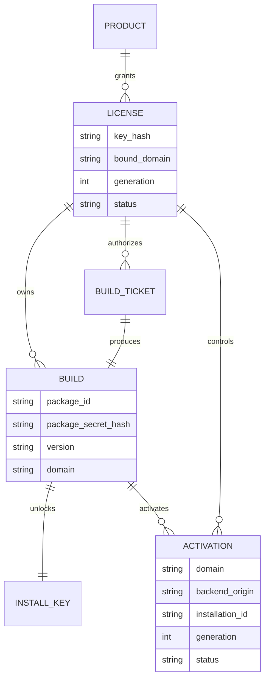

# APPGOG 授权系统架构（冻结版 v1）

日期：2026-09-22

## 一、用户看到的流程

```text
购买 APPGOG
  → 获得长期固定 Key
  → 在打包站输入固定 Key、版本和域名
  → 下载客户专属 ZIP 和本次一次性安装 Key
  → 安装 ZIP
  → 第一次打开 APPGOG 后台
  → 输入本次安装 Key、固定 Key 和 Xboard 后台地址
  → 激活成功
  → 开放 APPGOG 后台
```

更新或重装时重复“固定 Key 打包 → 新 ZIP → 新安装 Key → 激活”。

## 二、五种身份，不得混用

| 身份 | 生命周期 | 用户可见 | 用途 |
|---|---|---:|---|
| License Key | 长期 | 是 | 购买资格、打包、更新、换域名、轮换 Key |
| Build Ticket | 约 15 分钟、一次性 | 否 | 授权本次 Worker 构建 |
| Package Secret | 每个 ZIP 唯一 | 否 | 证明运行代码确实来自该构建 |
| Install Key | 每个 ZIP 一个、成功后作废 | 是 | 第一次打开后台时激活 |
| Activation Token | 短期、可刷新 | 否 | 本地运行时验签和环境绑定 |

固定 Key 不进入主题包；安装 Key 不能登录打包站；Package Secret 不能代替在线激活；签名私钥永不进入 Worker 或客户 ZIP。

## 三、数据关系



## 四、必须保持的安全规则

1. 数据库只保存 License Key、Build Ticket、Package Secret、Install Key 和 Refresh Secret 的 HMAC-SHA-256 摘要，不保存明文。
2. 固定 Key 第一次打包时绑定域名；换域名必须走明确的解绑/迁移流程。
3. Build Ticket 与 Install Key 的消费必须位于数据库写事务中，不能先查询再异步更新。
4. 每个 Build 都有独立 Package Secret，打包器可拆分和乱序注入，但它只是抗批量复制层，不是根信任。
5. 根信任是授权服务器的 Ed25519 私钥。客户包只持有公钥。
6. Activation Token 必须绑定 License generation、Build、Package、域名、后台 Origin 和 Installation ID。
7. 后台页面隐藏不等于授权。APPGOG 的设置读取、保存和关键配置接口都必须在服务端或可信运行层再次验签。
8. 正常运行优先本地验签，按周期联网刷新；授权服务器短暂故障不能立即让客户站点白屏。
9. Key 轮换增加 License generation。旧 Key 立刻不能打包，旧激活在下一次刷新时失效。
10. 所有签发、打包、激活、轮换、解绑和撤销操作必须写审计日志。

## 五、复制到其他服务器为何失败

激活凭证同时包含：

```text
License ID + Generation
Build ID + Package ID
授权域名
Xboard 后台 Origin
Installation ID
过期时间
Ed25519 签名
```

复制整个目录后，只要域名、后台地址或安装环境发生变化，本地 SDK 就拒绝凭证。旧的一次性安装 Key 已消费，无法在新环境重新激活。修改凭证字段会破坏数字签名。

## 六、现实安全边界

客户控制自己的服务器和浏览器，因此不存在百分之百不可破解的前端授权。系统目标是：

- 阻止普通用户复制目录后直接使用；
- 阻止同一个安装 Key 重复激活；
- 阻止固定 Key跨域名打包；
- 让每个泄露包可追踪到 License 和 Build；
- 允许卖家撤销、轮换和审计；
- 显著提高批量破解成本。

代码混淆、片段乱序和文件名变化是保护层，不能代替服务端绑定和数字签名。
