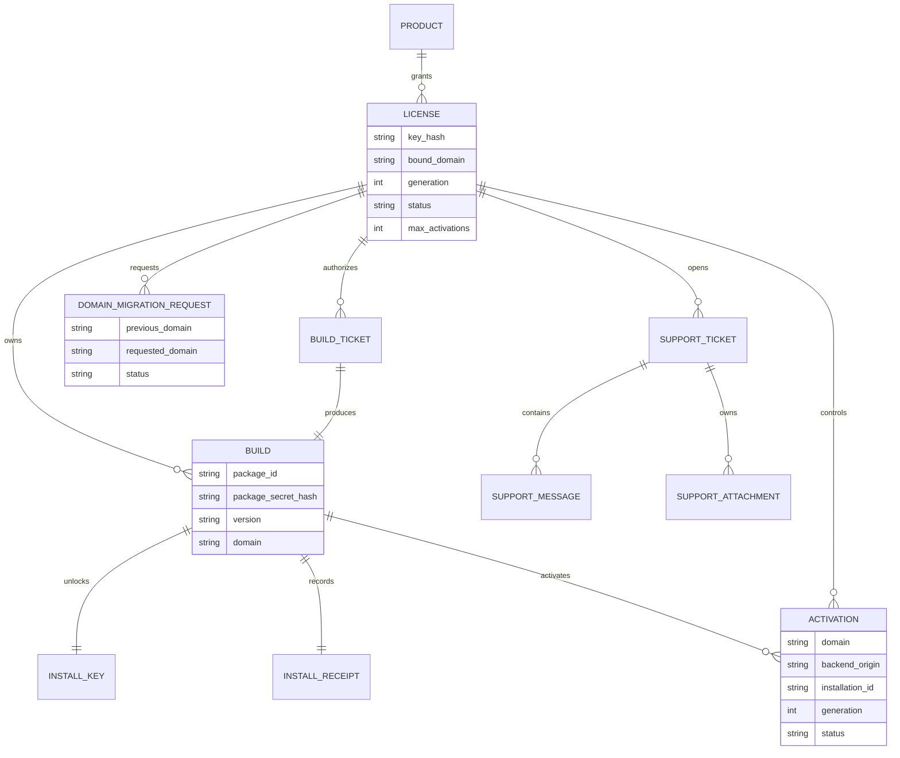

# APPGOG打包授权系统架构（v1.2.13）

日期：2026-09-24

v1.2.13 完成领域 Service 与 Repository Phase 3 边界。授权兼容门面只组合 Product Catalog、Licensing、Entitlement、Packaging Authorization、Activation 和 Audit 服务；Portal 兼容门面只组合 Customer Projection、Admin Projection 和 License Erasure；全库 Repository 由十个领域 SQLite Adapter 组成，主门面不再声明 SQL 或执行业务查询。每个 Service 只能接收自己的 Repository Port，跨领域撤销通过受控生命周期 Port 完成，现有 URL、字段、数据库和事务语义保持兼容。

## 一、用户看到的流程

```text
购买 APPGOG
  → 获得长期固定 Key
  → 在打包站使用固定 Key 登录，首次绑定域名并选择版本
  → 下载客户专属 ZIP 和本次一次性安装 Key
  → 安装 ZIP，只输入本次一次性 Install Key
  → 服务端验证包与环境，消费 Install Key 并签发 Install Receipt
  → APPGOG 正式功能仍保持锁定
  → 第一次打开 APPGOG 后台
  → 只输入长期固定 License Key
  → 服务端验证 Install Receipt、包、域名和环境后正式激活
  → 开放 APPGOG 后台
```

更新或重装时重复“固定 Key 打包 → 新 ZIP → 新安装 Key → 激活”。客户仅能构建最新已发布版本或重新构建当前已激活版本，不提供业务层面的历史版本回滚包。部署升级失败时仍由安装器内部恢复旧程序链接与旧健康镜像，这是系统保护机制，不是客户可操作的版本功能。

## 二、六种身份，不得混用

| 身份 | 生命周期 | 用户可见 | 用途 |
|---|---|---:|---|
| License Key | 长期 | 是 | 购买资格、打包、更新和换域名；换绑时保持原 Key |
| Build Ticket | 约 15 分钟、一次性 | 否 | 授权本次 Worker 构建 |
| Package Secret | 每个 ZIP 唯一 | 否 | 证明运行代码确实来自该构建 |
| Install Key | 每个 ZIP 一个、安装解锁成功后作废 | 是 | 第一阶段安装解锁 |
| Install Receipt | 每次成功安装解锁一个 | 否 | 证明第一阶段已完成并绑定安装环境 |
| Activation Token | 短期、可刷新 | 否 | 本地运行时验签和环境绑定 |

固定 Key 不进入主题包；安装 Key 不能登录打包站；Install Receipt 不能代替固定 Key；Package Secret 不能代替在线激活；签名私钥永不进入 Worker 或客户 ZIP。

## 三、数据关系



## 四、必须保持的安全规则

1. 数据库只保存 License Key、Build Ticket、Package Secret、Install Key 和 Refresh Secret 的 HMAC-SHA-256 摘要，不保存明文。
2. 固定 Key 可由卖家预绑定，也可由客户首次登录后绑定；客户可按后台配置的冷却时间自助即时换域名，不需要管理员审批。
3. Build Ticket 与 Install Key 的消费必须位于数据库写事务中，不能先查询再异步更新。
4. 每个 Build 都有独立 Package Secret，打包器可拆分和乱序注入，但它只是抗批量复制层，不是根信任。
5. 根信任按用途拆成 Activation、Package 和 Notification 三套 Ed25519 私钥；任何用途不得回退复用另一把密钥。客户包只持有对应公钥。
6. Activation Token 必须绑定 License generation、Build、Package、域名、后台 Origin 和 Installation ID。
7. 后台页面隐藏不等于授权。APPGOG 的设置读取、保存和关键配置接口都必须在服务端或可信运行层再次验签。
8. 正常运行优先本地验签，按周期联网刷新；授权服务器短暂故障不能立即让客户站点白屏。
9. 域名换绑增加 License generation，立即撤销旧 Activation 与未使用 Install Receipt；固定 Key 保持不变，新域名必须重新输入原 Key 激活。管理员显式轮换 Key 属于独立高风险操作。
10. 成品完成前必须同时校验整包 SHA-256、Ed25519 签名包身份、逐文件 SHA-256 与 Package Secret HMAC。
11. 所有签发、打包、激活、轮换、域名绑定/迁移和撤销操作必须写审计日志。

## 五、复制到其他服务器为何失败

激活凭证同时包含：

```text
License ID + Generation
Build ID + Package ID
授权域名
Xboard 后台 Origin
Installation ID
过期时间
Ed25519 签名
```

复制整个目录后，只要域名、后台地址或安装环境发生变化，本地 SDK 就拒绝凭证。旧的一次性安装 Key 已消费，无法在新环境重新激活。修改凭证字段会破坏数字签名。

## 六、现实安全边界

默认单容器中的授权中心、打包中心、Worker 和 Caddy 共享 UID 与文件系统。角色环境变量做最小化传递，但不能阻止同容器受攻击进程读取其他角色文件；当前仅处理 ZIP，不执行上传源码。独立 Worker 节点接口保留用于高级扩展。

客户控制自己的服务器和浏览器，因此不存在百分之百不可破解的前端授权。系统目标是：

- 阻止普通用户复制目录后直接使用；
- 阻止同一个安装 Key 重复激活；
- 阻止固定 Key跨域名打包；
- 让每个泄露包可追踪到 License 和 Build；
- 允许卖家撤销、轮换和审计；
- 显著提高批量破解成本。

构建流水线会删除 Source Map、向 JS/CSS 注入每包水印、随机化授权运行时标识符与保护目录，并通过 Package Secret 派生 AES-256-GCM 密钥加密包身份载荷。这些措施是提高静态提取和跨包拼接成本的保护层，不能代替服务端绑定和数字签名；为保证未知 Xboard 主题兼容性，不对所有第三方业务代码实施激进控制流重写。

## 七、签名密钥边界

| 密钥 | 唯一职责 | 允许进入客户包 |
|---|---|---:|
| Activation Signing Key | 签发 Activation Token、Install Receipt 相关可信声明 | 仅公钥 |
| Package Signing Key | 签发构建清单和安装包身份 | 仅公钥 |
| Notification Signing Key | 签发版本推送与更新通知 | 仅公钥 |

旧部署升级时，Activation Key 必须保持原值。缺失的 Package/Notification Key 可以首次自动生成，但已有合法值不得被覆盖。三类私钥都不得进入 Worker、浏览器、客户 ZIP、普通日志或诊断包。

`GET /api/v1/public-key` 的 `public_key` 字段保留为 Activation 公钥兼容别名；新客户端必须读取 `public_keys.activation`、`public_keys.package` 和 `public_keys.notification`。

## 八、服务器安装身份与受控迁机

客户产品的 Installation ID 不再只是调用方提交的普通字符串。标准接入由产品服务器在持久目录生成 Ed25519 安装身份密钥对，Installation ID 等于安装公钥 SPKI 的 SHA-256 指纹。私钥不离开产品服务器。

服务端为安装、刷新和迁机签发短期一次性 Challenge。产品服务器必须签署包含用途、Challenge、Build/Package、域名、后台 Origin 和 Installation ID 的规范化载荷；Challenge 只能消费一次。复制数据库、复制 Installation ID 或重放旧签名均不能取得新凭证。

客户产品迁机使用一次性 `PMG_` Grant：目标服务器生成新的安装密钥和 Installation ID，验证成功后取得新 Activation；旧 Installation Identity 与旧 Activation 同时进入 Fenced。相同业务域名不等于相同服务器，也不允许两台服务器长期 Active。

## 九、套餐和能力执行

授权计划分为免费版、付费版和历史兼容版。计划能力在签发时形成快照并写入签名 Activation Token。能力限制必须同时在以下位置执行：

1. 授权中心业务规则；
2. 客户专属安装包运行时；
3. SDK 本地验签结果；
4. 产品服务端关键接口 Guard。

只在 UI 隐藏按钮不构成授权限制。后端必须根据签名能力拒绝免费版无权调用的操作。

## 十、控制中心迁移边界

控制中心迁移与客户产品迁机是两条独立流程。控制中心迁移搬运 APPGOG 自身的数据库、签名密钥、配置、上传、成品、附件和 Caddy 状态，继承原授权域名和公钥身份，不修改客户 License、客户域名或 Installation ID。

目标服务器必须先安装同版本程序，通过一次性配对建立上传会话。最终加密备份按 64 MiB 分块上传，每块 SHA-256 校验并允许固定序号重传；全部分块齐全后再次校验整包 SHA-256，才允许宿主机执行固定恢复请求。迁移接口不接受任意路径、SQL 或 Shell。

源端最终快照前进入短暂只读。目标恢复并通过健康检查后提升所有权 generation，源端同时写入数据库状态和 `source-fenced.json`，普通 restart 不能恢复写入。目标失败则恢复目标迁移前备份，源端自动恢复 Active。当前 SQLite 架构保证数据一致性，但不承诺完全零停机。
