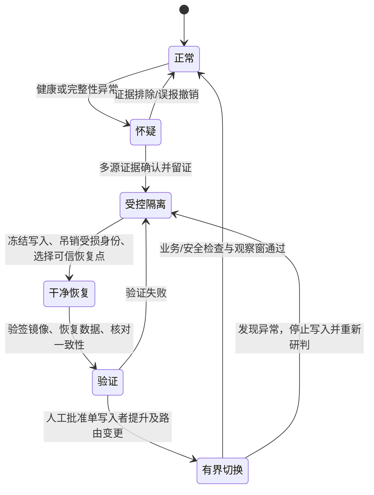

# APPGOG 三中心容灾体系设计

状态：设计稿，2026-10-01。与 [安全架构](security-center-architecture.md) 配套。本文件的目标和流程不代表已经部署或通过灾难恢复演练。

## 1. 范围和事实基线

- 形态 A：授权与打包同一台 Linux，云端安全中心另一台。形态 B：授权、打包、云端安全中心各一台。备份库属于独立信任域，可由异地对象存储加离线副本承担，不要求再启动一个可对业务机下命令的控制服务器。
- 业务仓库当前 `scripts/docker.sh backup` 停止写入容器，归档 SQLite/WAL、密钥、上传、成品等，再用 OpenSSL 加密；恢复要求目标部署无运行中服务，备份恢复密钥须独立保存。它尚未提供异地不可变留存、定时备份验证和自动切换。
- 现有客户迁机流程有 fencing 和 generation 约束；不能把客户实例迁机机制直接当成三中心主服务的自动容灾。云端当前状态文件和最近 300 条事件存在本机，外部探测与报告过期告警已实现，长期独立日志与云端数据异地恢复尚缺。
- Cloudflare 是单独的管理和流量信任域。云端安全中心只读探测无法代替 Cloudflare 管理审计和账号找回。

## 2. 总图（允许两种业务拓扑）

```mermaid
flowchart LR
  U[管理员和客户] --> CF[Cloudflare 边缘 / DNS]
  CF --> A[授权中心 A<br/>业务和签名服务]
  CF --> B[打包中心 B<br/>构建任务和产物]
  B -.仅实际需要的授权 API.-> A
  A --- LA[本机安全代理]
  B --- LB[本机安全代理]
  LA -- 主动 mTLS 上报 --> C[独立云端安全中心 C]
  LB -- 主动 mTLS 上报 --> C
  C -- 公网 HTTPS 只读探测 --> A
  C -- 公网 HTTPS 只读探测 --> B
  A -- 备份作业 / 最小权限写入 --> V[独立异地不可变备份库]
  B -- 备份作业 / 最小权限写入 --> V
  C -- 状态和审计备份 --> V
  L[离线签名与密钥保管] -- 验签公钥和签名制品 --> A
  L -- 验签公钥和签名制品 --> B
  V -- 仅隔离恢复环境可读取 --> R[干净的恢复机 / 演练环境]
  O[独立告警接收人] <-- 监测告警 / 备份失败告警 --- C
  O <-- 带外通知 --- V
```

形态 A 中 A、B 可部署于同一宿主机，但凭据、服务、数据目录和角色身份仍须分隔；同机故障按两个中心同时故障处理。形态 B 使用各自的业务宿主机。C 不持有 A/B 的 SSH、Docker API、备份删除权、发布签名私钥。备份库的管理员、保留策略与删除权独立于三中心生产凭据；生产备份身份只能写入指定范围。所有恢复操作由独立管理通道发起，先验签、核对数据，再提升服务。

## 3. 故障域和服务目标

目标值为规划指标，不是现有能力承诺；业务影响分析、备份频率和真实演练后方可确立 SLA。

| 故障域 | 目标 RPO | 目标 RTO | 前提及降级方式 |
|---|---:|---:|---|
| 授权中心业务数据 | 1 小时 | 4 小时 | 一致性增量或高频快照、异地副本、干净恢复机；恢复前冻结新签发和管理写操作 |
| 打包队列/上传/成品 | 4 小时 | 8 小时 | 上传与成品备份；可重建任务要有幂等标识，暂停新交付直至产物验签 |
| 云端状态/告警 | 15 分钟 | 4 小时 | 独立日志转发和异地状态备份；失联期间业务代理本地留证 |
| Cloudflare 账号或边缘 | 以服务商状态和备用接入方案确定 | 以演练测得 | 先冻结管理凭据和 DNS 变更；业务机继续独立检查，绝不把边缘探测失败当作文件失陷 |

RPO 是最多可接受的数据丢失时间，RTO 是恢复服务的最长目标时间。当前停写完整备份本身无法证明上述目标；要实现高频目标，需先增加一致性备份流水线、异地不可变存储和自动校验，不可直接把当前备份脚本放进高频定时任务。

## 4. 备份分层与密钥边界

1. 数据层：授权 SQLite（含一致性 WAL 检查点）、授权记录、签名密钥、配置；打包源文件、任务元数据和成品；云端节点登记、可信基线、CA/轮换状态与事件。按数据分类分别加密、清单列出版本、时间、主机、文件摘要和数据库一致性结果。保留发布镜像和安装器的签名验证材料。
2. 副本层：生产机本地短期副本、独立账户/区域的不可变异地副本、离线恢复副本。保留策略与删除权独立；备份上传账号无删除/改保留期权限。云端的备份也进入独立库，避免云端失守后同时删除所有证据。
3. 密钥层：备份密钥、授权签名私钥、云端 CA 私钥和发布签名私钥用途分离；恢复密钥离线或受独立密钥系统保护，不与加密包、Git、CI 日志放在一起。备份身份的泄露只能新增备份，不能覆盖历史版本。
4. 验证层：每次备份核对加密包摘要、元数据和完成标记；周期性在隔离环境执行真实解密、数据库完整性校验、业务启动和只读健康检查。仅检查文件存在或解密成功不足以证明可恢复。

## 5. 响应状态机与切换门槛



- 在切换前对旧主执行 fencing：撤销其写入身份、停止写入入口并保存证据；记录所有权 generation，新的恢复节点只在证明旧主已失去写入权后接管。同一数据集永远只有一个写入者。无法确认旧主状态则保持只读/延迟切换，防止脑裂。
- 先恢复鉴权与密钥边界，再恢复授权业务，再恢复打包与客户交付，最后补齐历史审计与运营面板。恢复点以已知干净时间、签名版本和数据校验选择；若入侵时间不明，不得自动选最新备份。
- 自动动作仅限留证、告警、阻止新高风险操作和预配置且可撤销的局部隔离；删除容器、重建主机、提升备用机、恢复密钥和 DNS 切换需要明确授权、证据与回滚记录。

## 6. 分场景运行手册

| 场景 | 立即动作 | 恢复与重新接入 |
|---|---|---|
| 打包中心受损 | 停新构建与交付、留存任务/主机证据，吊销该节点身份 | 干净机器重装，验签程序与源包，恢复上传/成品/队列，核对授权调用和客户产物后恢复交付 |
| 授权中心受损 | 暂停新授权签发、吊销受损凭据、通知云端标记不可信 | 从已知干净备份恢复数据库与签名身份，审计可疑签发记录；证书与业务凭据按影响轮换，再开放打包调用 |
| 云端中心受损 | A/B 停止接纳云端新策略，继续本机受限检查和独立告警 | 重建 C，恢复经签名确认的基线、状态和审计，轮换 CA/节点凭据，分阶段重新配对；不相信可疑云端下发材料 |
| 两中心之间断网 | 节点本地留证、标记云端结果过期；暂停远端更新或受控高风险动作 | 验证证书、时钟、身份与新鲜报告后恢复；不因三次探测失败盲回滚 |
| 同机硬件故障或机房故障 | 两业务角色一起降级；从带外渠道判断影响范围 | 在独立干净宿主机恢复授权再恢复打包；校验单写入者和数据恢复点 |
| Cloudflare 账号或 DNS 失守 | 从独立设备冻结账号会话、令牌和变更权限，导出审计记录 | 恢复可信 DNS/边缘配置并多点验证；服务器文件健康不等于边缘配置健康 |
| 备份库或恢复密钥失守 | 冻结备份写入身份，保全不可变版本及审计 | 在隔离环境确认可用恢复点，轮换备份身份与密钥；不可通过受损生产机验证完整性 |

## 7. 可交付子系统和演练合同

- 备份控制器：按角色选择范围，先做一致性快照，生成清单与加密包，上传异地不可变库，返回备份作业状态；保留失败告警。现有停写完整备份保留作人工冷备路径。
- 恢复控制器：只接受离线授权的恢复会话，执行签名、摘要、密钥与数据版本检查，先部署到隔离环境；记录旧主 fencing、单写入者、DNS/入口切换与撤销步骤。拒绝在非空生产卷执行覆盖恢复。
- 安全面板：展示每个中心最后成功备份时间、最近恢复演练、当前 RPO 差距、云端报告新鲜度、隔离状态和告警投递状态。任何未配置/过期/不可用状态显示未知或红灯。
- 演练：每月在隔离环境恢复随机备份；每季度演练单节点失守、云端失守和断网恢复；每半年演练同机故障与三机跨宿主切换。记录起止时间、数据恢复点、丢失范围、异常凭据、业务探测和回退结果；目标未达成即调整频率或资源，不虚报 RPO/RTO。
- 发布门槛：Linux 两机/三机首装、升级、密钥轮换、异地备份恢复、误报撤销、断线、旧主重上线围栏、恶意备份拒绝、签名镜像拒绝，以及 Cloudflare 账号失守独立处置桌面演练。CI 模拟不能替代真实跨主机演练。

## 8. 实施顺序与当前缺口

1. 固化资产清单和业务影响分析，确认目标时间与备份存储方案；先建立离线恢复密钥和最小权限不可变副本。
2. 实现备份控制器、异地副本、独立日志；在隔离机验证恢复。完成之前，面板的 RPO/RTO 一律为“目标未验证”。
3. 实现 fencing 和 generation 协议、受控恢复控制器与只读预演；通过单写入者和失联重上线演练后才开放切换。
4. 与安全中心告警、签名发布和 Cloudflare 带外审计对接；逐项完成两机、三机实机验收，最后决定正式发布和生产启用。

当前仓库已具备人工加密完整备份、空目标恢复和客户迁机围栏；尚未具备上述异地不可变备份、备份验真与恢复控制器、三中心单写入切换。云端也未完成长期独立日志、异地恢复和本机/云端失守实机演练。任何开发完成与正式上线结论必须以对应测试和现场证据为准。

参考依据：NIST SP 800-34 Rev.1（业务影响、恢复策略与演练）；NIST SP 800-61 Rev.3（事件响应与恢复）；CISA #StopRansomware Guide（离线加密备份、恢复测试与干净镜像）。
