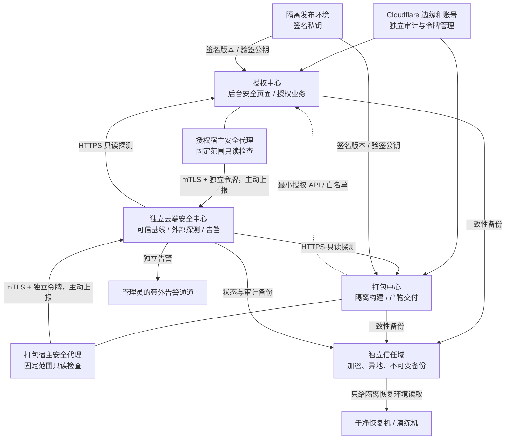

# 三中心安全查杀与容灾体系：需求整合报告

报告日期：2026-10-01。此文先统一目标、边界、验收和开发顺序；它是开发前的设计报告，不能作为生产已完成的证明。容灾细节见 [容灾体系设计](disaster-recovery-architecture.md)，现有安全基线见 [三中心安全架构](security-center-architecture.md)。

## 一、用户目标和范围

在现有授权与打包一体源码的基础上，保持原同机一键安装可用；再支持授权、打包各自独立 Linux 安装。独立云端安全中心使用单独仓库和单独服务器，能在授权中心失守时继续监测、告警和辅助恢复。授权中心后台有“安全查杀中心”页面，可一键检查自己的 Linux 环境并查看授权、打包及云端状态。三中心要有文件变更、环境异常、病毒特征、身份与连通性检查，按证据分级响应，配套可信更新、备份和容灾。两台业务同机加一台云端，以及三台各一中心的部署形态都要验证。首次安装、升级、回滚和环境诊断尽量由脚本自动完成，保留所有已有数据、密钥和业务设置。

范围包括：源码和供应链、Linux 宿主机、容器、应用管理权限、签名发布、Cloudflare 管理边界、异地备份、故障切换和演练。此前提出的“加密算法中心以及桥归属改变”已明确暂缓，不计入本轮。不能承诺彻底杜绝攻击；目标是缩小攻击面、尽早发现、限制影响和可验证恢复。

## 二、整体架构

两机部署：授权与打包同宿主，云端独立。三机部署：三个中心分别在独立宿主。两种形态都要求身份、数据目录、服务账户和备份权限按角色区分。同机无法抵御宿主 root 失守，同宿主故障会同时影响授权与打包。

云端只监测、核对、留证和建议预设动作；不持有业务机 SSH、Docker socket、任意命令执行或发布签名私钥。业务机不把单份来自自身的遥测当作可信证据。恢复决策综合本机事件、云端独立探测、备份状态及离线发布签名。

## 三、功能合同

| 模块 | 必须交付的能力 | 拒绝/边界 |
|---|---|---|
| 授权后台页面 | 本机一键检查、逐项范围与状态、打包/云端报告新鲜度、告警历史、备份与演练状态、受控处置入口 | 只有管理员 `system.manage` 可触发；CSRF、限流、审计；不得输入任意路径或命令；未检查显示未知 |
| 宿主安全代理 | 授权和打包各自固定清单的文件摘要、服务/端口/账户/持久化检查、扫描时间和失败原因；可选病毒特征引擎 | 独立最小权限、资源和时间上限；扫描不可用/未覆盖不报健康；敏感文件不上传；不可由云端直接执行命令 |
| 持续监测 | 周期报告、报告过期和恢复事件、宿主高风险事件的独立转发、云端 HTTPS 只读探测及可信发布基线比对 | 报告仅最近值或进程自报不构成完整取证；基线不能从受疑生产主机自动批准 |
| 查杀与封控 | 告警、保存证据、冻结新的高风险构建/签发；多源证据确认后执行预设、可撤销、限时的局部隔离 | 不按单个哈希变化自动删除文件、清空卷、断整机网络或盲回滚；分级授权和回退记录必须存在 |
| 身份与更新 | 节点 mTLS、独立角色令牌和轮换；业务机只拉取已验签的发布版本与策略 | 云端失守不能推送命令；未签名或版本不兼容的镜像/策略一律拒绝；私钥不进入云端 |
| 安装脚本 | 现有同机模式继续；`license`/`build` 独立角色安装；云端仓库有自身一键脚本；首装/升级/诊断/回滚与健康检查 | 只对已列明的 Linux、CPU、包管理器和 systemd 自动补依赖；不支持的环境明确失败，升级不能覆盖数据和合法配置 |
| 容灾 | 一致性备份、独立加密密钥、异地不可变副本、隔离恢复演练、单写入者围栏和受控切换 | 不能依赖被攻破机器提供唯一备份/密钥；恢复必须确认干净版本和数据点；旧主不允许重新并行写入 |
| Cloudflare | 管理员 MFA/会话/令牌最小权限、DNS 与配置变更审计、带外告警、独立找回手册 | 服务器查杀不能证明 Cloudflare 账号安全；边缘故障和服务器完整性结果分开显示 |

## 四、三大极端场景与容灾

1. **授权被攻破**：打包调用凭据和授权签名身份视为受影响；停止新签发与高风险交付，独立云端仍可外部探测、留存既有基线和告警。保全证据、吊销凭据、在干净主机恢复授权数据库、核查可疑签发，验证后再开放打包调用。容器隔离不能兜底宿主 root。
2. **云端失联**：本机固定范围扫描和本地留证继续；云端结果转为过期/未知，远端更新与高风险自动处置暂停。本地可信缓存版本仅在签名和数据兼容校验后可恢复。连不上三次只是告警依据，不触发强删和流量 80% 封锁。
3. **云端被攻破**：业务端停用来自该云端的策略和镜像源，不允许其 SSH/Push 执行；独立管理通道吊销云端身份，利用离线公钥验签正式镜像，从独立备份恢复 C，并轮换 CA/节点身份。云端日志需要外送，防止攻击者在本机清除证据。
4. **打包被攻破或同机故障**：冻结新构建和交付；从可信源与备份重建，复核产物和客户源码；同机故障按授权和打包双重失效处理。
5. **Cloudflare 或备份域失守**：独立设备执行账号冻结、令牌轮换和 DNS 审计；备份账号失守则保护不可变版本、轮换上传身份，在隔离恢复机测试可用恢复点。恢复点不盲选最新，防止恢复植入后门的快照。

目标服务指标暂定：授权 RPO 1 小时/RTO 4 小时，打包 RPO 4 小时/RTO 8 小时，云端状态 RPO 15 分钟/RTO 4 小时。这是设计目标，当前停写式本地备份和云端最近 300 条事件无法满足；需要业务影响分析、持续备份/外送和真实演练后才能作为承诺。

## 五、开发顺序和完成定义

| 阶段 | 实施结果 | 可核验门槛 |
|---|---|---|
| A. 现状固化 | 数据与密钥清单、调用方向、支持系统矩阵、风险基线和恢复目标 | 每台主机、卷、账号、云端和 CF 的资产责任清晰 |
| B. 最小可信检测 | 宿主代理、本机页面、病毒特征受限扫描、独立日志、文件/环境变更判定 | 真 Linux 权限/CSRF/限流/超时/未安装引擎/恶意文件测试；未知不得显示为通过 |
| C. 分级处置 | 证据关联、冻结高风险操作、可撤销隔离、审计和误报撤销 | 对抗演练中不丢数据，不误杀正常更新；越权指令拒绝 |
| D. 可信更新和容灾 | 镜像/源码验签、异地不可变备份、密钥分离、恢复控制器、单写入者围栏 | 随机备份真实恢复；旧主重上线不双写；恶意产物拒绝；留有回退记录 |
| E. 两种拓扑 | 同机业务+云端、授权/打包/云端三机；一键安装/升级/诊断/回滚与身份轮换 | apt/dnf、x86_64/aarch64 支持范围；mTLS 正反例；断线/恢复、升级/回滚、DNS/证书校验 |
| F. 正式交付 | 两仓全量测试、Linux/Docker CI、业务仓源合同、签名制品、正式标签与 Release、生产前备份、现场健康验收 | 所有仓库门槛通过；真实生产变更有目标、影响、备份和回滚证据；服务对外与内部检查均通过 |

按故障单独演练：授权失守、打包失守、云端失守、失联、同机宕机、三机节点切换、Cloudflare 账号失守、备份不可读和旧主重新上线。记录发现、隔离、恢复时间、数据恢复点与实际丢失量。正式版在这些门槛未满足前不得宣称“顶级防护完成”。

## 六、截至报告日的实际状态

| 项目 | 已有证据 | 尚缺 |
|---|---|---|
| 业务仓库 `Universal-authorization` | 候选分支 `candidate/security-center-1.2.63` / Draft PR #2，授权后台固定范围只读 Linux 检查、Unix socket 代理、systemd 接入；Ubuntu/Docker 候选 CI 成功 | 病毒特征扫描、独立宿主事件采集、自动封控、两/三机实测、签名正式发布和生产上线 |
| 独立云端 `Cloud-based-Scanning-and-Removal-Center` | 候选分支 `candidate/cloud-report-freshness-0.1.2` / Draft PR #1，节点报告过期/恢复事件、mTLS 测试、Ubuntu 候选 CI 成功 | 独立长期日志与不可变备份、云端实机恢复、生产部署、完整故障演练 |
| 业务备份 | 加密完整备份、独立恢复密钥、空目标恢复；客户迁机已有围栏思路 | 异地不可变副本、定期可恢复性验证、三中心单写入切换、目标 RPO/RTO 证明 |
| 云端服务器 | `202.181.24.79:1500` 曾仅验证 TCP 可连接 | SSH 身份、系统现状、可用权限、备份和变更窗口未核实；未部署 |

本报告定稿后的第一开发批次：修复安装器以 root 执行可切换发布路径的风险；加入受限病毒特征扫描、明确覆盖率与不可用状态；再接独立宿主事件和备份/恢复能力。每批先补真实测试，再跑全量和 Linux/Docker CI；完成实机门槛才考虑正式发布与上线。

## 七、决策默认值

- 自动处置默认只告警并暂停新的高风险动作；关键服务隔离要求多源证据、可撤销策略和审计。涉及主服务切换与删除数据始终需要明确批准。
- 安装脚本自动补齐受支持依赖，不声称“任意 Linux 都能安装”；不支持的发行版、架构或服务管理器直接给诊断。
- 保留现有一体化源码与同机安装，分机部署由角色和身份边界实现；不把项目拆成互不兼容的分叉。
- 云端安全机仅属于安全域；异地备份和发布签名属于另外的信任域，可以由独立服务/离线介质承担。
